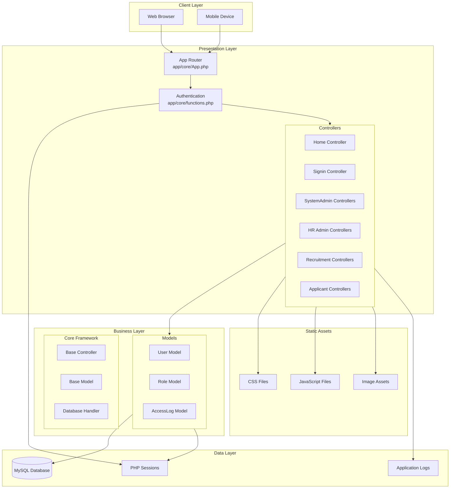
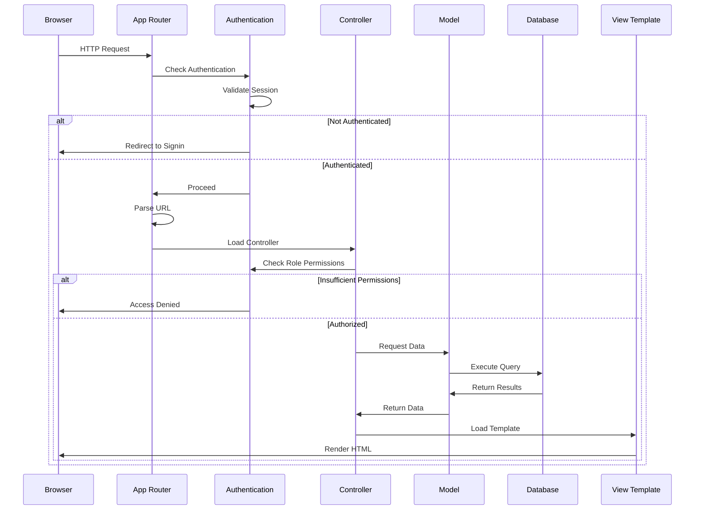
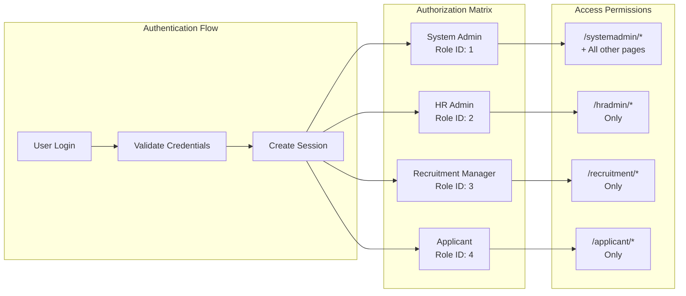
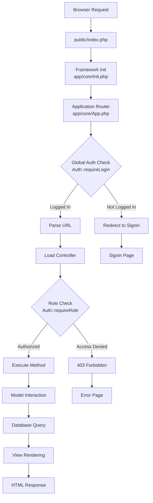
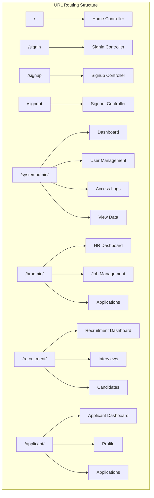
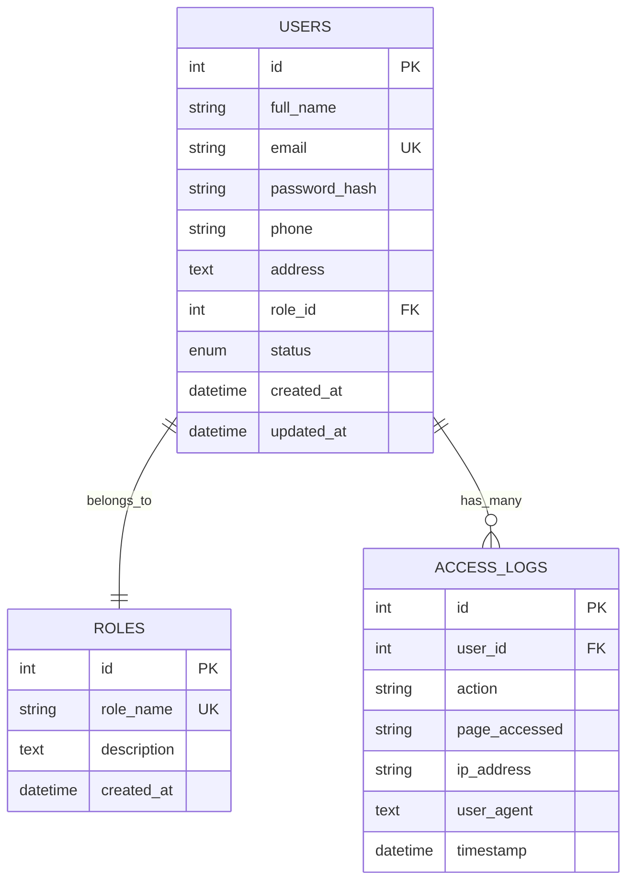

# System Architecture Documentation

## Overview
HireFlow is built using a custom PHP MVC (Model-View-Controller) framework with role-based access control, designed for recruitment management with multiple user types.

## Default Users for Testing
```
System Admin:      admin@hireflow.com / Password@1
HR Admin:          hr@hireflow.com / Password@1
Recruitment Mgr:   recruiter@hireflow.com / Password@1
Applicant:         athsara@hireflow.com / Password@1
```

## Database Files
- `Database-Backup/hireflow_db.sql` - **Complete database backup** (recommended for setup)
- `Database-Backup/SETUP_GUIDE.md` - **Step-by-step import instructions**
- `Database-Backup/DATABASE_SCHEMA.md` - **Complete schema documentation**
- `database_schema.sql` - Database structure with default users
- `dummy_data.sql` - Additional test data (70+ records) for development

## System Architecture Diagram



## MVC Architecture Flow



## Architecture Components

### 1. MVC Framework Structure
```
app/
├── controllers/          # Request handling and business logic
│   ├── systemadmin/     # System admin controllers
│   ├── hradmin/         # HR admin controllers  
│   ├── recruitment/     # Recruitment manager controllers
│   ├── applicant/       # Applicant controllers
│   └── *.php           # General controllers (Home, Signin, etc.)
├── core/               # Framework core components
│   ├── App.php         # Main application router
│   ├── Controller.php  # Base controller class
│   ├── Model.php       # Base model class
│   ├── Database.php    # Database connection handler
│   ├── functions.php   # Global utility functions
│   ├── config.php      # Configuration settings
│   └── init.php        # Framework initialization
├── models/             # Data models and business logic
│   ├── User.php        # User management model
│   ├── Role.php        # Role management model
│   └── AccessLog.php   # Access logging model
└── views/              # User interface templates
    ├── systemadmin/    # System admin views
    ├── hradmin/        # HR admin views
    ├── recruitment/    # Recruitment views
    ├── applicant/      # Applicant views
    └── *.view.php      # General views
```

### 2. Public Assets Structure
```
public/
├── index.php           # Application entry point
├── robots.txt          # Search engine directives
├── url-test.php        # Development testing interface
└── assets/
    ├── css/            # Stylesheets
    │   ├── main.css    # Global styles
    │   ├── utils.css   # Utility classes
    │   ├── components/ # Component-specific styles
    │   └── systemadmin/ # Role-specific styles
    ├── js/             # JavaScript files
    │   ├── main.js     # Global JavaScript
    │   └── components/ # Component scripts
    └── images/         # Static images
```

## Core Components

### 1. Application Router (`app/core/App.php`)
```php
class App
{
    public function __construct()
    {
        $url = $this->parseUrl();
        $this->checkGlobalAuth($url);
        $this->routeRequest($url);
    }
}
```

**Responsibilities**:
- URL parsing and routing
- Global authentication enforcement
- Controller instantiation
- Request delegation

### 2. Base Controller (`app/core/Controller.php`)
```php
class Controller
{
    public function view($view, $data = [])
    {
        // Load view templates with data
    }
    
    public function model($model)
    {
        // Load and instantiate models
    }
}
```

**Features**:
- View rendering with data passing
- Model loading and instantiation
- Common controller functionality

### 3. Base Model (`app/core/Model.php`)
```php
class Model
{
    protected $db;
    protected $table;
    
    public function findAll() { /* ... */ }
    public function find($id) { /* ... */ }
    public function where($conditions) { /* ... */ }
    public function create($data) { /* ... */ }
    public function update($id, $data) { /* ... */ }
    public function delete($id) { /* ... */ }
}
```

**Features**:
- Active Record pattern implementation
- Database query abstraction
- CRUD operations
- Validation methods

### 4. Database Handler (`app/core/Database.php`)
```php
class Database
{
    private $pdo;
    
    public function connect()
    {
        // PDO connection with error handling
    }
    
    public function query($sql, $params = [])
    {
        // Prepared statement execution
    }
}
```

**Features**:
- PDO-based database connections
- Prepared statement support
- Connection pooling
- Error handling

## Authentication & Authorization

### 1. Authentication System
```php
class Auth
{
    // Core authentication methods
    public static function login($email, $password)
    public static function logout()
    public static function logged_in()
    
    // Authorization methods
    public static function requireLogin()
    public static function requireRole($roleId)
    public static function requireMinRole($minRoleId)
    public static function hasRole($roleId)
    
    // User data access
    public static function user()
    public static function user_id()
    public static function user_role()
    
    // Security features
    public static function generateCSRFToken()
    public static function verifyCSRFToken($token)
}
```

### 2. Role-Based Access Control



```
┌─────────────────┬──────────────────┬─────────────────────────────┐
│ Role ID         │ Role Name        │ Access Permissions          │
├─────────────────┼──────────────────┼─────────────────────────────┤
│ 1               │ System Admin     │ /systemadmin/* + all pages  │
│ 2               │ HR Admin         │ /hradmin/* only             │
│ 3               │ Recruitment Mgr  │ /recruitment/* only         │
│ 4               │ Applicant        │ /applicant/* only           │
└─────────────────┴──────────────────┴─────────────────────────────┘
```

### 3. Session Management
```php
// Session structure
$_SESSION = [
    'USER' => [
        'id' => 1,
        'full_name' => 'User Name',
        'email' => 'user@domain.com',
        'role_id' => 2,
        'status' => 'active'
    ],
    'LOGIN_TIME' => 1693834567,
    'csrf_token' => 'secure_random_token'
];
```

## Request Flow

### 1. Request Lifecycle



```
1. Browser Request → public/index.php
2. Framework Initialization → app/core/init.php
3. Application Router → app/core/App.php
4. Global Auth Check → Auth::requireLogin()
5. URL Parsing → parseUrl()
6. Controller Loading → $controller = new $controllerName()
7. Method Execution → $controller->$method($params)
8. Model Interaction → $this->model('ModelName')
9. View Rendering → $this->view('template', $data)
10. Response Output → HTML to browser
```

### 2. URL Structure & Routing



```
Base URL: http://localhost/HireFlow/public
Routes:
  /                           → Home controller
  /signin                     → Signin controller
  /signup                     → Signup controller
  /systemadmin/dashboard      → systemadmin/Dashboard controller
  /hradmin/job-posts         → hradmin/JobPosts controller
  /recruitment/applications   → recruitment/Applications controller
  /applicant/dashboard       → applicant/Applicant->dashboard()
```

### 3. Error Handling
```php
// Global error handling
try {
    // Application logic
} catch (Exception $e) {
    error_log($e->getMessage());
    redirect('404');
}

// Database errors
try {
    $result = $db->query($sql, $params);
} catch (PDOException $e) {
    error_log("Database error: " . $e->getMessage());
    return false;
}
```

## Data Layer

### 1. Model Architecture & Database Relationships



```php
// Example User model
class User extends Model
{
    protected $table = 'users';
    protected $allowedColumns = ['full_name', 'email', 'phone', 'address'];
    
    public function validateLogin($data)
    {
        // Validation logic
    }
    
    public function authenticate($email, $password)
    {
        // Authentication logic
    }
    
    public function createUser($data)
    {
        // User creation with validation
    }
}
```

### 2. Database Abstraction
```php
// Query examples
$users = $user->findAll();
$user = $user->find($id);
$hrAdmins = $user->where(['role_id' => 2, 'status' => 'active']);
$user->create($userData);
$user->update($id, $updateData);
$user->delete($id);
```

### 3. Data Validation
```php
class Model
{
    protected function validate($data, $rules)
    {
        foreach ($rules as $field => $rule) {
            if (!$this->validateField($data[$field], $rule)) {
                return false;
            }
        }
        return true;
    }
}
```

## Frontend Architecture

### 1. Component Architecture

```mermaid
graph TB
    subgraph "CSS Architecture"
        MainCSS[main.css<br/>Global Styles]
        UtilsCSS[utils.css<br/>Utility Classes]
        
        subgraph "Components"
            AlertCSS[alert.css]
            ButtonCSS[button.css]
            CardCSS[card.css]
            InputCSS[input.css]
            ModalCSS[modal.css]
            TableCSS[table.css]
            ToastCSS[toast.css]
        end
        
        subgraph "Role-Specific"
            SAStyles[systemadmin/<br/>dashboard.style.css]
            HRStyles[hradmin/<br/>styles.css]
            RecStyles[recruitment/<br/>styles.css]
        end
    end
    
    subgraph "JavaScript Architecture"
        MainJS[main.js<br/>Global Scripts]
        
        subgraph "Component Scripts"
            ModalJS[modal.js]
            ToastJS[toast.js]
        end
    end
    
    MainCSS --> Components
    MainCSS --> Role-Specific
    MainJS --> Component Scripts
```

### 2. CSS Framework
```css
/* Utility-first approach */
.container { max-width: 1200px; margin: 0 auto; }
.btn { padding: 0.5rem 1rem; border-radius: 0.25rem; }
.card { background: white; border-radius: 0.5rem; box-shadow: 0 2px 4px rgba(0,0,0,0.1); }

/* Component-based styles */
.modal { /* Modal component styles */ }
.toast { /* Toast notification styles */ }
.table { /* Table component styles */ }
```

### 2. JavaScript Architecture
```javascript
// Component-based JavaScript
class Modal {
    constructor(element) {
        this.element = element;
        this.init();
    }
    
    init() {
        // Initialize modal functionality
    }
    
    show() {
        // Show modal
    }
    
    hide() {
        // Hide modal
    }
}

// Global application object
const HireFlow = {
    init() {
        // Initialize application
    },
    
    components: {
        modal: new Modal('.modal'),
        toast: new Toast('.toast')
    }
};
```

### 3. View Templates
```php
<!-- Role-based view rendering -->
<?php if(Auth::hasRole(1)): ?>
    <!-- System admin content -->
<?php elseif(Auth::hasRole(2)): ?>
    <!-- HR admin content -->
<?php elseif(Auth::hasRole(3)): ?>
    <!-- Recruitment manager content -->
<?php else: ?>
    <!-- Applicant content -->
<?php endif; ?>
```

## Security Architecture

### 1. Input Validation
```php
function sanitizeInput($data)
{
    return htmlspecialchars(trim($data), ENT_QUOTES, 'UTF-8');
}

function validateEmail($email)
{
    return filter_var($email, FILTER_VALIDATE_EMAIL);
}
```

### 2. SQL Injection Prevention
```php
// Always use prepared statements
$stmt = $pdo->prepare("SELECT * FROM users WHERE email = ? AND role_id = ?");
$stmt->execute([$email, $roleId]);
$result = $stmt->fetchAll();
```

### 3. CSRF Protection
```php
// Generate token
$token = bin2hex(random_bytes(32));
$_SESSION['csrf_token'] = $token;

// Validate token
if (!hash_equals($_SESSION['csrf_token'], $_POST['csrf_token'])) {
    die('CSRF token mismatch');
}
```

## Performance Considerations

### 1. Database Optimization
- Indexed foreign keys
- Query optimization with EXPLAIN
- Connection pooling
- Prepared statement caching

### 2. Caching Strategy
```php
// Simple file-based caching
class Cache
{
    public static function get($key)
    {
        $file = "cache/{$key}.cache";
        if (file_exists($file) && time() - filemtime($file) < 3600) {
            return unserialize(file_get_contents($file));
        }
        return false;
    }
    
    public static function set($key, $data)
    {
        file_put_contents("cache/{$key}.cache", serialize($data));
    }
}
```

### 3. Asset Optimization
- CSS/JS minification
- Image optimization
- Browser caching headers
- CDN integration ready

## Development Tools

### 1. Debug Mode
```php
// Enable in development
define('DEBUG_MODE', true);

if (DEBUG_MODE) {
    ini_set('display_errors', 1);
    error_reporting(E_ALL);
}
```

### 2. Testing Interface
- `url-test.php` for manual testing
- Role-based page access verification
- Sample data for testing scenarios

### 3. Logging
```php
class Logger
{
    public static function log($level, $message, $context = [])
    {
        $log = date('Y-m-d H:i:s') . " [{$level}] {$message}" . PHP_EOL;
        file_put_contents('logs/app.log', $log, FILE_APPEND);
    }
}
```

## Deployment Architecture

### 1. Environment Configuration
```php
// Different configs for different environments
switch (ENVIRONMENT) {
    case 'development':
        define('DB_HOST', 'localhost');
        define('DEBUG_MODE', true);
        break;
    case 'production':
        define('DB_HOST', 'prod-server');
        define('DEBUG_MODE', false);
        break;
}
```

### 2. File Permissions
```bash
# Recommended permissions
chmod 755 public/
chmod 644 public/index.php
chmod 700 app/core/config.php
chmod 755 public/uploads/
```

### 3. Web Server Configuration
```apache
# .htaccess for URL rewriting
RewriteEngine On
RewriteCond %{REQUEST_FILENAME} !-f
RewriteCond %{REQUEST_FILENAME} !-d
RewriteRule ^(.*)$ index.php?url=$1 [QSA,L]
```

## Scalability Considerations

### 1. Horizontal Scaling
- Stateless session management
- Database connection pooling
- Load balancer ready architecture

### 2. Modular Design
- Plugin architecture ready
- API endpoints for mobile apps
- Microservices migration path

### 3. Monitoring
- Application performance monitoring
- Database query monitoring
- User activity tracking
- Error reporting and alerting
