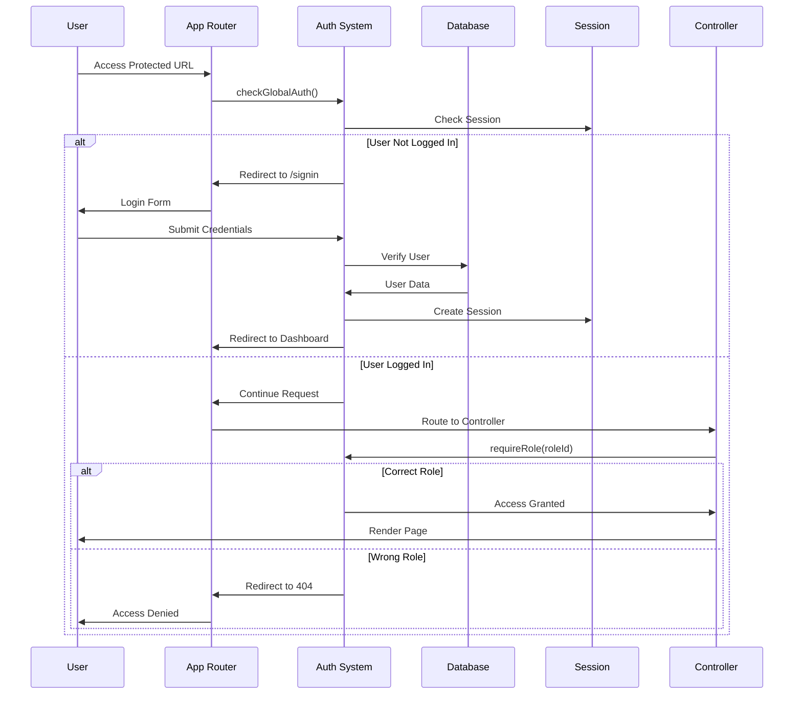
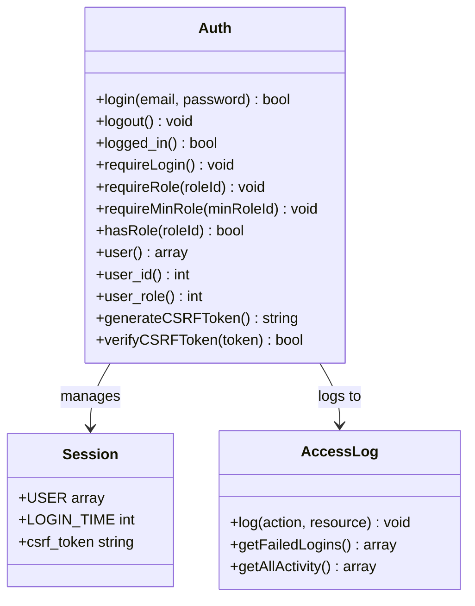
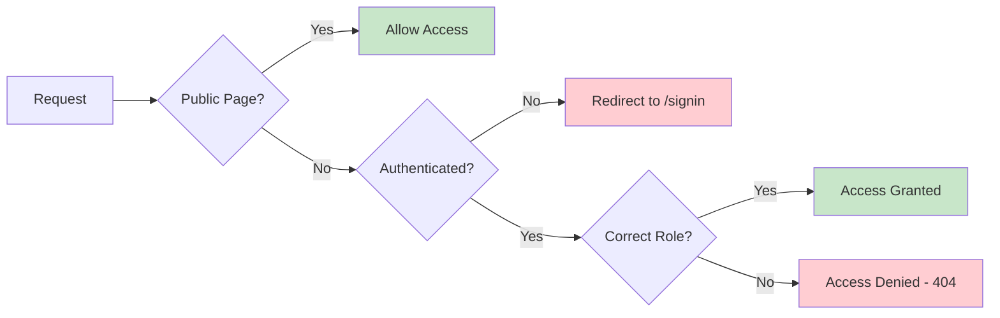
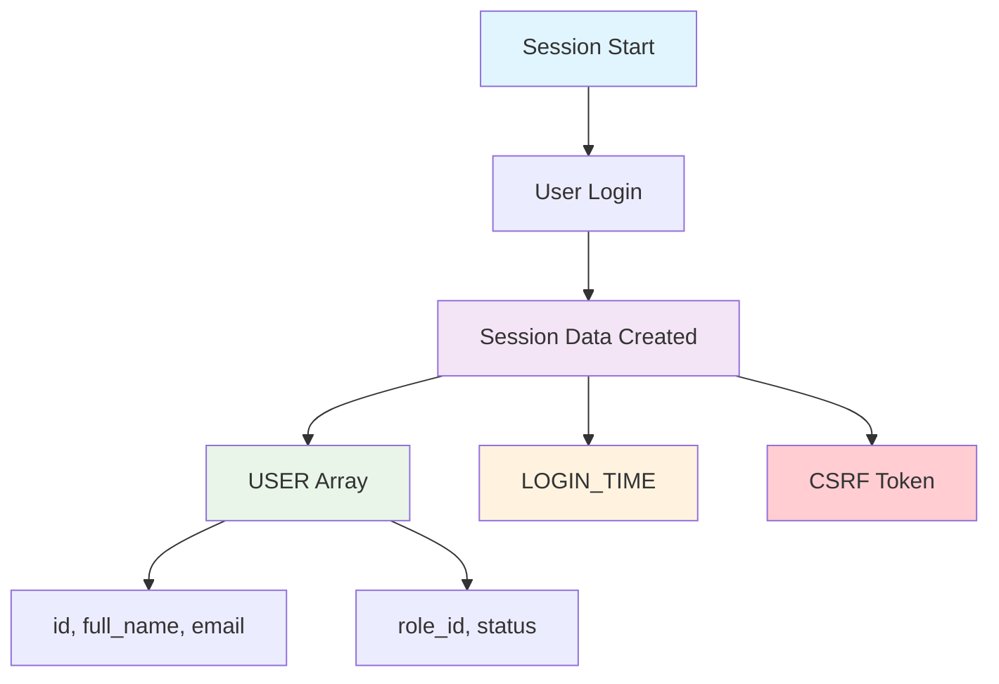
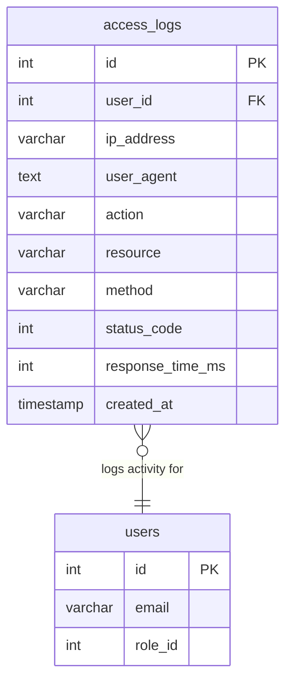
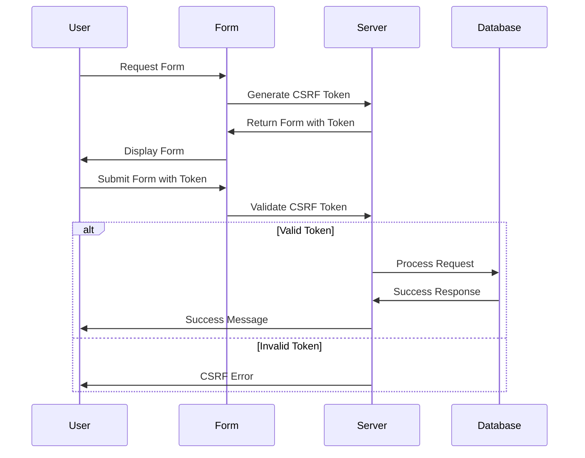
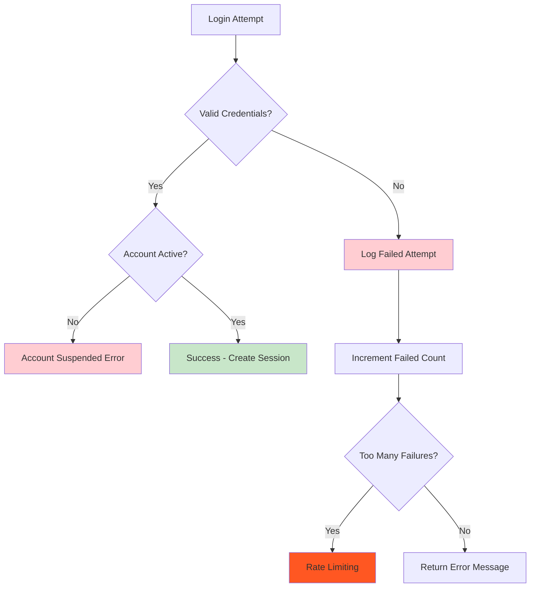
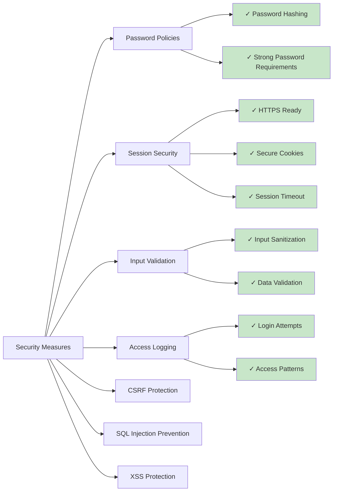

# Authentication & Security Documentation

## Default Test Accounts
```
System Admin: admin@hireflow.com / Password@1
HR Admin: hr@hireflow.com / Password@1
Recruitment Manager: recruiter@hireflow.com / Password@1
Applicant: athsara@hireflow.com / Password@1
```

## Overview
HireFlow implements a comprehensive role-based authentication system with session management and access control.

## Authentication Flow Diagram



## Role-Based Access Control Architecture

```mermaid
graph TD
    A[User Request] --> B{Authenticated?}
    B -->|No| C[Redirect to /signin]
    B -->|Yes| D{Check Role Permission}
    
    D -->|System Admin| E[Full Access]
    D -->|HR Admin| F[HR Resources Only]
    D -->|Recruitment Manager| G[Recruitment Resources Only]
    D -->|Applicant| H[Applicant Resources Only]
    D -->|Invalid Role| I[Access Denied - 404]
    
    E --> J[/systemadmin/*]
    F --> K[/hradmin/*]
    G --> L[/recruitment/*]
    H --> M[/applicant/*]
    
    style A fill:#e1f5fe
    style E fill:#ffcdd2
    style F fill:#f3e5f5
    style G fill:#e8f5e8
    style H fill:#fff3e0
    style I fill:#ffebee
```

## Authentication Architecture

### 1. Role-Based Access Control (RBAC)
```
Role ID | Role Name           | Access Level | Permissions
--------|--------------------|--------------|-----------------------------------------
1       | System Admin       | Full System  | User management, system settings, all views
2       | HR Admin          | HR Operations| Job posting, application management
3       | Recruitment Manager| Recruitment  | Interview management, candidate evaluation  
4       | Applicant         | Public       | Job browsing, application submission
```

### 2. Authentication Methods

#### Core Auth Class (`app/core/Auth.php`)



### 3. Access Control Implementation

#### Global Authentication Guard
Located in `app/core/App.php`:
```php
private function checkGlobalAuth($url)
{
    $publicPages = ['', 'home', 'signin', 'signup', 'url-test'];
    $currentPage = strtolower($url[0] ?? '');
    
    if (!in_array($currentPage, $publicPages) && !Auth::logged_in()) {
        redirect('signin');
        exit();
    }
}
```

#### Controller-Level Protection



Each role-specific controller implements:
```php
// System Admin controllers
Auth::requireRole(1);

// HR Admin controllers  
Auth::requireRole(2);

// Recruitment Manager controllers
Auth::requireRole(3);

// Applicant controllers
Auth::requireRole(4);
```

### 4. Password Security

#### Security Flow
```mermaid
flowchart TD
    A[User Password Input] --> B[password_hash()]
    B --> C[Store Hashed Password]
    
    D[Login Attempt] --> E[password_verify()]
    E --> F{Match?}
    F -->|Yes| G[Authentication Success]
    F -->|No| H[Authentication Failed]
    
    G --> I[Create Session]
    H --> J[Log Failed Attempt]
    
    style A fill:#e1f5fe
    style C fill:#e8f5e8
    style G fill:#c8e6c9
    style H fill:#ffcdd2
```

#### Implementation
```php
// During registration/password change
$hashedPassword = password_hash($plainPassword, PASSWORD_DEFAULT);

// During login verification
if (password_verify($plainPassword, $storedHash)) {
    // Authentication successful
}
```

### 5. Session Management

#### Session Data Structure


```php
$_SESSION = [
    'USER' => [
        'id' => 1,
        'full_name' => 'John Doe',
        'email' => 'john@example.com',
        'role_id' => 2,
        'status' => 'active'
    ],
    'LOGIN_TIME' => 1693834567,
    'csrf_token' => 'random_secure_token'
];
```

#### Session Security
- Automatic session regeneration on login
- Session timeout enforcement  
- CSRF token generation and validation
- Session cleanup on logout

### 6. Access Logging

#### Log Structure (`access_logs` table)



#### Implementation
```php
AccessLog::log($action, $resource, $method, $statusCode);
```

### 7. URL-Based Route Protection

#### Protected Routes by Role

```mermaid
graph TD
    A[URL Request] --> B{Parse Route}
    
    B --> C[/systemadmin/*]
    B --> D[/hradmin/*]
    B --> E[/recruitment/*]
    B --> F[/applicant/*]
    B --> G[/profile]
    B --> H[Public Routes]
    
    C --> I{Role = 1?}
    D --> J{Role = 2?}
    E --> K{Role = 3?}
    F --> L{Role = 4?}
    G --> M{Authenticated?}
    H --> N[Allow Access]
    
    I -->|Yes| O[Access Granted]
    I -->|No| P[Access Denied]
    J -->|Yes| O
    J -->|No| P
    K -->|Yes| O
    K -->|No| P
    L -->|Yes| O
    L -->|No| P
    M -->|Yes| O
    M -->|No| P
    
    style O fill:#c8e6c9
    style P fill:#ffcdd2
    style N fill:#e1f5fe
```

```
/systemadmin/*     → System Admin only (role_id = 1)
/hradmin/*         → HR Admin only (role_id = 2)  
/recruitment/*     → Recruitment Manager only (role_id = 3)
/applicant/*       → Applicant only (role_id = 4)
/profile           → All authenticated users
```

#### Public Routes
```
/                  → Home page
/signin           → Login form
/signup           → Registration (applicants only)
/url-test         → Development testing page
```

### 8. Security Features

#### CSRF Protection Flow


- Token generation: `Auth::generateCSRFToken()`
- Token validation: `Auth::verifyCSRFToken($token)`
- Automatic token inclusion in forms

#### SQL Injection Prevention
- Prepared statements in all database queries
- Parameter binding for user inputs
- Input sanitization and validation

#### XSS Prevention
- Output escaping with `htmlspecialchars()`
- Content Security Policy headers
- Input validation and filtering

### 9. Error Handling

#### Authentication Failures



- Failed login attempts logged
- Automatic redirect to signin page
- Rate limiting considerations for brute force protection

#### Access Denied
- Role-based access violations redirect to 404
- Unauthorized access attempts logged
- Graceful error handling and user feedback

### 10. Development & Testing

#### Testing Authentication
- Use `url-test.php` for comprehensive route testing
- Check role-based access control
- Verify session management
- Test CSRF protection

### 11. Configuration

#### Session Settings
```php
// Session timeout (in functions.php)
ini_set('session.gc_maxlifetime', 3600); // 1 hour

// Cookie settings
session_set_cookie_params([
    'lifetime' => 3600,
    'path' => '/',
    'secure' => false, // Set to true for HTTPS
    'httponly' => true,
    'samesite' => 'Strict'
]);
```

#### Database Configuration
```php
// Database connection (app/core/config.php)
define('DBNAME', 'hireflow_db');
define('DBHOST', 'localhost');
define('DBUSER', 'root');
define('DBPASS', '');
```

## Security Best Practices

### Implementation Checklist


1. **Password Policies**: Implement strong password requirements
2. **Session Security**: Use HTTPS in production, secure cookie settings
3. **Input Validation**: Validate and sanitize all user inputs
4. **Access Logging**: Monitor and audit all authentication events
5. **Regular Updates**: Keep PHP and dependencies updated
6. **Error Handling**: Don't expose sensitive information in error messages
7. **Rate Limiting**: Implement protection against brute force attacks
8. **Database Security**: Use least privilege principle for database users

## Troubleshooting

### Common Issues
1. **Session not persisting**: Check PHP session configuration
2. **Access denied errors**: Verify user role assignments
3. **Login failures**: Check password hashing compatibility
4. **CSRF token errors**: Ensure tokens are properly generated and validated

### Debug Information
- Enable error reporting in development
- Check access logs for authentication events
- Verify database connections and queries
- Test role-based access control systematically
