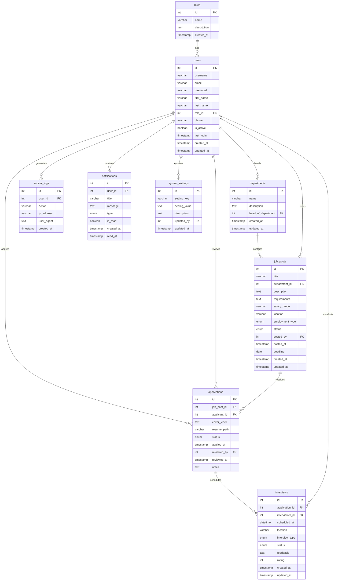
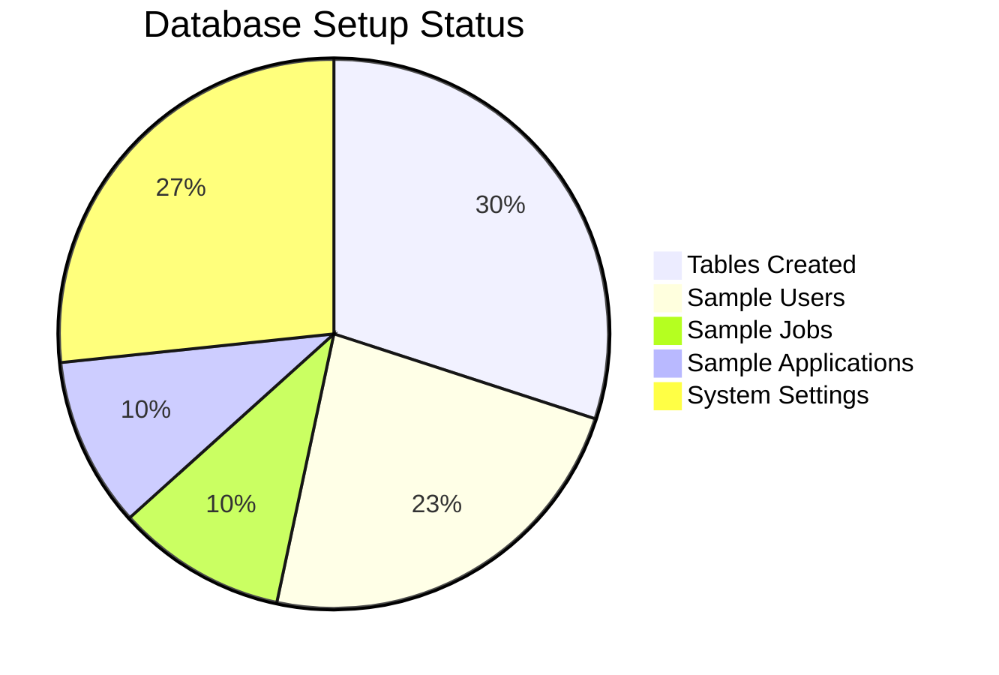

# HireFlow Database Documentation

## 📊 Database Overview

HireFlow uses a MySQL database with a comprehensive schema designed to handle recruitment management efficiently. The database consists of 9 interconnected tables that manage users, roles, job postings, applications, interviews, and system settings.

### 🗄️ Database Name: `hireflow_db`

## 🔐 Authentication & Setup Process

### Initial Setup
1. Run database setup: `http://localhost/HireFlow/database-setup.php`
2. Create initial admin: `http://localhost/HireFlow/admin-setup.php`
3. Login and create other admin accounts through User Management

### User Creation Process
- **System Administrator**: Created via one-time setup page
- **Other Admins**: Created by System Admin through User Management
- **Applicants**: Self-registration through normal signup

### Security Features
- ✅ **Plain text passwords** (temporary - see AUTH-SOLUTION.md)
- ✅ **Email-based authentication** (no username required)
- ✅ **Role-based access control** (RBAC)
- ✅ **Session management** with security checks
- ✅ **Access logging** for audit trails
- ✅ **Account status management** (active/inactive/suspended)

## 🚀 Complete Setup Guide

### Prerequisites
- XAMPP with MySQL installed and running
- PHP 7.4 or higher
- Web browser access
- Git (for cloning the repository)

### For First-Time Users (Complete Setup Guide)

#### Step 1: Install XAMPP
1. **Download XAMPP**
   - Go to [https://www.apachefriends.org/](https://www.apachefriends.org/)
   - Download the latest version for your operating system (Windows/Mac/Linux)
   - Choose the version with PHP 8.0+ for best compatibility

2. **Install XAMPP**
   - Run the installer as Administrator (Windows) or with sudo (Mac/Linux)
   - Install to default location (usually `C:\xampp` on Windows)
   - Select components: Apache, MySQL, PHP, phpMyAdmin

3. **Start XAMPP Services**
   - Open XAMPP Control Panel
   - Start **Apache** service (for web server)
   - Start **MySQL** service (for database)
   - Verify both show "Running" status with green background

#### Step 2: Clone and Setup HireFlow
1. **Clone Repository**
   ```bash
   git clone https://github.com/AthsaraFernando/HireFlow.git
   cd HireFlow
   ```

2. **Move to XAMPP Directory**
   ```bash
   # Windows
   copy -r HireFlow C:\xampp\htdocs\
   
   # Mac/Linux  
   sudo cp -r HireFlow /opt/lampp/htdocs/
   ```

3. **Set Permissions (Mac/Linux only)**
   ```bash
   sudo chmod -R 755 /opt/lampp/htdocs/HireFlow
   sudo chown -R daemon:daemon /opt/lampp/htdocs/HireFlow
   ```

#### Step 3: Database Setup Options

##### Option A: One-Click Automated Setup (Recommended)

1. **Create Database**
   - Open phpMyAdmin (http://localhost/phpmyadmin)
   - Create new database named `hireflow_db`
   - Set collation to `utf8mb4_general_ci`

2. **Configure Database Connection** (if not already done)
   - Open `app/core/config.php`
   - Verify database credentials:
   ```php
   define('DB_HOST', 'localhost');
   define('DB_NAME', 'hireflow_db');
   define('DB_USER', 'root');
   define('DB_PASS', ''); // Usually empty for XAMPP
   ```

3. **Run Automated Setup Script**
   - Open your browser and navigate to: `http://localhost/HireFlow/database-setup.php`
   - The script will automatically:
     - ✅ Test database connection
     - ✅ Create all 9 tables with proper relationships
     - ✅ Insert sample data for testing
     - ✅ Set up user accounts and permissions
     - ✅ Configure system settings

##### Option B: Manual Setup (Alternative)

1. **Access phpMyAdmin**
   - Open web browser
   - Go to `http://localhost/phpmyadmin`
   - Login with username: `root`, password: (leave empty for XAMPP default)

2. **Create Database and Tables**
   - Create new database named `hireflow_db`
   - Click on the database to select it
   - Click "SQL" tab and execute the table creation scripts (see SQL section below)

#### Step 4: Create Initial Administrator
1. **Create Initial Admin Account**
   - Navigate to: `http://localhost/HireFlow/admin-setup.php`
   - Fill in your administrator details
   - This creates the first System Administrator account
   - Page automatically disables after first admin is created

2. **Login and Setup Other Accounts**
   - Login at: `http://localhost/HireFlow/public?url=signin`
   - Use the User Management system to create other admin accounts
   - HR Admins and Recruitment Managers can be created through the interface

### Current Login Process
After creating your admin account:
- **Login URL**: `http://localhost/HireFlow/public?url=signin`
- **Email**: Your chosen email during setup
- **Password**: Your chosen password during setup
- **Password:** password123
- **Role:** System Administrator

⚠️ **Important:** Change default passwords before deploying to production!

### Troubleshooting

#### Common Issues
1. **"Access denied" error**
   - Check if MySQL service is running in XAMPP
   - Verify database credentials in config.php
   - Ensure database 'hireflow_db' exists

2. **"Table already exists" warnings**
   - This is normal if running setup multiple times
   - The script uses IF NOT EXISTS to prevent errors

3. **Foreign key constraint errors**
   - Ensure all tables are created in correct order
   - Check if referenced tables exist
   - The script handles dependencies automatically

4. **Permission denied errors**
   - Run XAMPP as Administrator (Windows)
   - Check file permissions on database files

### Sample Data Included

#### Default Users (7 Complete Accounts)
| Role | Username | Email | Password | 
|------|----------|-------|----------|
| **System Admin** | admin | admin@hireflow.com | password123 |
| **HR Admin** | hr_admin | hr@hireflow.com | password123 |
| **Recruitment Manager** | recruiter | recruiter@hireflow.com | password123 |
| **Applicant** | john_doe | john.doe@email.com | password123 |
| **Applicant** | jane_smith | jane.smith@email.com | password123 |
| **Applicant** | alex_wilson | alex.wilson@email.com | password123 |
| **Applicant** | priya_j | priya.j@email.com | password123 |

#### Sample Departments (5 Complete Departments)
| ID | Name | Description | Head |
|----|------|-------------|------|
| 1 | Human Resources | Manages recruitment, employee relations, and HR policies | HR Admin |
| 2 | Information Technology | Handles software development, system administration, and technical support | HR Admin |
| 3 | Marketing | Responsible for brand management, digital marketing, and customer outreach | HR Admin |
| 4 | Finance | Manages company finances, budgeting, and financial reporting | HR Admin |
| 5 | Operations | Oversees daily operations, process improvement, and logistics | HR Admin |

#### Sample Job Posts (3 Complete Jobs)
| Title | Department | Location | Status | Deadline |
|-------|------------|----------|--------|----------|
| **Senior Software Engineer** | IT | New York, NY | Active | 2025-09-30 |
| **Junior Data Analyst** | IT | Remote | Active | 2025-09-15 |
| **Marketing Specialist** | Marketing | Los Angeles, CA | Active | 2025-09-20 |

#### Sample Applications & Data
- **Applications**: 3 sample applications with different statuses
- **Interviews**: 2 scheduled interviews with feedback
- **Notifications**: 4 sample notifications for different scenarios
- **Access Logs**: Sample security monitoring entries
- **System Settings**: 8 configuration options

## 📊 Database Schema

### Entity Relationship Diagram (EER)

```
                    ┌─────────────────┐
                    │     roles       │
                    │─────────────────│
                    │ PK │ id         │
                    │    │ name       │
                    │    │ description│
                    │    │ created_at │
                    └─────────────────┘
                             │
                             │ 1:N
                             ▼
    ┌─────────────────┐    ┌─────────────────┐    ┌─────────────────┐
    │  departments    │    │     users       │    │ system_settings │
    │─────────────────│    │─────────────────│    │─────────────────│
    │ PK │ id         │◄──┐│ PK │ id         │┌──►│ PK │ id         │
    │    │ name       │   ││    │ username   ││   │    │ setting_key│
    │    │ description│   ││    │ email      ││   │    │ setting_val│
    │ FK │ head_of_   │───┘│    │ password   ││   │    │ description│
    │    │ department │    │    │ first_name ││   │ FK │ updated_by │───┘
    │    │ created_at │    │    │ last_name  ││   │    │ updated_at │
    │    │ updated_at │    │ FK │ role_id    │┘   └─────────────────┘
    └─────────────────┘    │    │ phone      │
             │             │    │ is_active  │
             │ 1:N         │    │ last_login │
             ▼             │    │ created_at │
    ┌─────────────────┐    │    │ updated_at │
    │   job_posts     │    └─────────────────┘
    │─────────────────│             │
    │ PK │ id         │             │ 1:N
    │    │ title      │             ▼
    │ FK │ department │◄────────────┼─── access_logs
    │    │ description│             │    notifications
    │    │ requirements│            │    applications (applicant_id)
    │    │ salary_range│            │    applications (reviewed_by)
    │    │ location   │             │    interviews (interviewer_id)
    │    │ employ_type│             │
    │    │ status     │             │
    │ FK │ posted_by  │─────────────┘
    │    │ posted_at  │
    │    │ deadline   │
    │    │ created_at │
    │    │ updated_at │
    └─────────────────┘
             │
             │ 1:N
             ▼
    ┌─────────────────┐
    │  applications   │
    │─────────────────│
    │ PK │ id         │
    │ FK │ job_post_id│
    │ FK │ applicant  │
    │    │ cover_letter│
    │    │ resume_path│
    │    │ status     │
    │    │ applied_at │
    │ FK │ reviewed_by│
    │    │ reviewed_at│
    │    │ notes      │
    └─────────────────┘
             │
             │ 1:N
             ▼
    ┌─────────────────┐
    │   interviews    │
    │─────────────────│
    │ PK │ id         │
    │ FK │ application│
    │ FK │ interviewer│
    │    │ scheduled  │
    │    │ location   │
    │    │ type       │
    │    │ status     │
    │    │ feedback   │
    │    │ rating     │
    │    │ created_at │
    │    │ updated_at │
    └─────────────────┘
```

### Mermaid ERD (Complete Relationships)



### Database Setup Completion Chart



## 📋 Complete Table Details

### 1. roles
**Purpose:** Defines user access levels and permissions throughout the system

| Column | Type | Constraints | Description |
|--------|------|-------------|-------------|
| id | INT | PK, AUTO_INCREMENT | Unique role identifier |
| name | VARCHAR(50) | UNIQUE, NOT NULL | Role name (System Administrator, HR Administrator, etc.) |
| description | TEXT | NULL | Role description and permissions overview |
| created_at | TIMESTAMP | DEFAULT CURRENT_TIMESTAMP | Role creation date |

**Sample Data:**
- System Administrator (Full system access)
- HR Administrator (Recruitment management) 
- Recruitment Manager (Candidate evaluation)
- Applicant (Job application access)

### 2. departments
**Purpose:** Organizational structure and job categorization system

| Column | Type | Constraints | Description |
|--------|------|-------------|-------------|
| id | INT | PK, AUTO_INCREMENT | Unique department identifier |
| name | VARCHAR(100) | UNIQUE, NOT NULL | Department name |
| description | TEXT | NULL | Department description and responsibilities |
| head_of_department | INT | FK → users(id) | Department head/manager reference |
| created_at | TIMESTAMP | DEFAULT CURRENT_TIMESTAMP | Creation date |
| updated_at | TIMESTAMP | DEFAULT CURRENT_TIMESTAMP ON UPDATE CURRENT_TIMESTAMP | Last update date |

**Sample Data:**
- Human Resources, IT, Marketing, Finance, Operations

### 3. users
**Purpose:** Central user management for all system users across all roles

| Column | Type | Constraints | Description |
|--------|------|-------------|-------------|
| id | INT | PK, AUTO_INCREMENT | Unique user identifier |
| full_name | VARCHAR(100) | NOT NULL | User's complete name |
| email | VARCHAR(100) | UNIQUE, NOT NULL | User email address (used for login) |
| password | VARCHAR(255) | NOT NULL | Bcrypt hashed password |
| phone | VARCHAR(20) | NULL | Contact phone number |
| address | TEXT | NULL | User's address |
| role_id | INT | FK → roles(id), NOT NULL | User role assignment |
| status | ENUM | 'active', 'inactive', 'suspended' | Account status |
| profile_picture | VARCHAR(255) | NULL | Profile image file path |
| last_login | TIMESTAMP | NULL | Last login time tracking |
| created_at | TIMESTAMP | DEFAULT CURRENT_TIMESTAMP | Account creation date |
| updated_at | TIMESTAMP | DEFAULT CURRENT_TIMESTAMP ON UPDATE CURRENT_TIMESTAMP | Last profile update |

**Key Features:**
- Email-based authentication (no username required)
- Secure bcrypt password hashing with complexity requirements
- Role-based access control
- Activity tracking
- Account status management
- Profile customization

**Current Passwords (Temporary):**
- Created by users during setup process
- See AUTH-SOLUTION.md for technical details

**Sample Users:**
- Created through admin-setup.php (System Administrator)
- Additional admins created through User Management
- Applicants self-register through normal signup

### 4. job_posts
**Purpose:** Job posting management and tracking throughout recruitment lifecycle

| Column | Type | Constraints | Description |
|--------|------|-------------|-------------|
| id | INT | PK, AUTO_INCREMENT | Unique job posting identifier |
| title | VARCHAR(200) | NOT NULL | Job title |
| department_id | INT | FK → departments(id) | Associated department |
| description | TEXT | NOT NULL | Detailed job description |
| requirements | TEXT | NULL | Job requirements and qualifications |
| salary_range | VARCHAR(100) | NULL | Salary information |
| location | VARCHAR(100) | NULL | Work location |
| employment_type | ENUM | 'full-time', 'part-time', 'contract', 'internship' | Employment type |
| status | ENUM | 'active', 'closed', 'draft' | Current posting status |
| posted_by | INT | FK → users(id), NOT NULL | User who created the posting |
| posted_at | TIMESTAMP | DEFAULT CURRENT_TIMESTAMP | Publication date |
| deadline | DATE | NULL | Application deadline |
| created_at | TIMESTAMP | DEFAULT CURRENT_TIMESTAMP | Creation date |
| updated_at | TIMESTAMP | DEFAULT CURRENT_TIMESTAMP ON UPDATE CURRENT_TIMESTAMP | Last modification date |

**Workflow States:**
- Draft → Active → Closed
- Supports deadline management
- Department categorization

### 5. applications
**Purpose:** Tracks job applications and their progression through the recruitment process

| Column | Type | Constraints | Description |
|--------|------|-------------|-------------|
| id | INT | PK, AUTO_INCREMENT | Unique application identifier |
| job_post_id | INT | FK → job_posts(id), NOT NULL | Applied job posting |
| applicant_id | INT | FK → users(id), NOT NULL | Applicant user |
| cover_letter | TEXT | NULL | Application cover letter |
| resume_path | VARCHAR(255) | NULL | Resume file path |
| status | ENUM | 'pending', 'shortlisted', 'rejected', 'hired' | Application status |
| applied_at | TIMESTAMP | DEFAULT CURRENT_TIMESTAMP | Application submission time |
| reviewed_by | INT | FK → users(id) | HR/Recruiter who reviewed |
| reviewed_at | TIMESTAMP | NULL | Review date |
| notes | TEXT | NULL | Reviewer notes and comments |

**Application Workflow:**
- Pending → Shortlisted/Rejected
- Shortlisted → Hired/Rejected
- Full audit trail maintained

### 6. interviews
**Purpose:** Interview scheduling and feedback management system

| Column | Type | Constraints | Description |
|--------|------|-------------|-------------|
| id | INT | PK, AUTO_INCREMENT | Unique interview identifier |
| application_id | INT | FK → applications(id), NOT NULL | Related application |
| interviewer_id | INT | FK → users(id), NOT NULL | Conducting interviewer |
| scheduled_at | DATETIME | NOT NULL | Interview date and time |
| location | VARCHAR(200) | NULL | Interview location/platform |
| interview_type | ENUM | 'phone', 'video', 'in-person' | Interview method |
| status | ENUM | 'scheduled', 'completed', 'cancelled', 'no-show' | Interview status |
| feedback | TEXT | NULL | Interview feedback and notes |
| rating | INT | CHECK (rating >= 1 AND rating <= 5) | Interview rating score |
| created_at | TIMESTAMP | DEFAULT CURRENT_TIMESTAMP | Schedule creation date |
| updated_at | TIMESTAMP | DEFAULT CURRENT_TIMESTAMP ON UPDATE CURRENT_TIMESTAMP | Last update date |

**Interview Features:**
- Multi-format support (phone, video, in-person)
- Rating system (1-5)
- Status tracking
- Feedback collection

### 7. access_logs
**Purpose:** Security monitoring and user activity tracking for audit purposes

| Column | Type | Constraints | Description |
|--------|------|-------------|-------------|
| id | INT | PK, AUTO_INCREMENT | Unique log entry identifier |
| user_id | INT | FK → users(id) | User who performed action |
| ip_address | VARCHAR(45) | NULL | User's IP address (IPv4/IPv6) |
| action | VARCHAR(255) | NOT NULL | Action performed |
| details | TEXT | NULL | Additional details about the action |
| user_agent | TEXT | NULL | Browser/device information |
| created_at | TIMESTAMP | DEFAULT CURRENT_TIMESTAMP | Action timestamp |

**Security Features:**
- Complete activity tracking
- IP address logging
- User agent tracking
- Audit trail maintenance

### 8. notifications
**Purpose:** In-app notification system for user communication

| Column | Type | Constraints | Description |
|--------|------|-------------|-------------|
| id | INT | PK, AUTO_INCREMENT | Unique notification identifier |
| user_id | INT | FK → users(id), NOT NULL | Notification recipient |
| title | VARCHAR(200) | NOT NULL | Notification title |
| message | TEXT | NOT NULL | Notification content |
| type | ENUM | 'info', 'success', 'warning', 'error' | Notification type |
| is_read | BOOLEAN | DEFAULT FALSE | Read status |
| created_at | TIMESTAMP | DEFAULT CURRENT_TIMESTAMP | Creation date |
| read_at | TIMESTAMP | NULL | When marked as read |

**Notification Types:**
- Info: General information
- Success: Positive actions
- Warning: Important alerts
- Error: Problem notifications

### 9. system_settings
**Purpose:** Application configuration management and system parameters

| Column | Type | Constraints | Description |
|--------|------|-------------|-------------|
| id | INT | PK, AUTO_INCREMENT | Unique setting identifier |
| setting_key | VARCHAR(100) | UNIQUE, NOT NULL | Configuration key |
| setting_value | TEXT | NULL | Configuration value |
| description | TEXT | NULL | Setting description |
| updated_by | INT | FK → users(id) | User who made changes |
| updated_at | TIMESTAMP | DEFAULT CURRENT_TIMESTAMP ON UPDATE CURRENT_TIMESTAMP | Last update time |

**Default Settings:**
- site_name: Application name
- max_file_size: Upload limits
- allowed_file_types: File restrictions
- session_timeout: Security settings
- email_notifications: Communication preferences

## 🔗 Database Relationships Summary

### Primary Relationships
- **roles** → **users** (1:N) - Each user has one role, roles can have multiple users
- **users** → **departments** (1:N) - Department heads are users
- **departments** → **job_posts** (1:N) - Jobs belong to departments
- **users** → **job_posts** (1:N) - Users create job postings
- **job_posts** → **applications** (1:N) - Jobs receive multiple applications
- **users** → **applications** (1:N) - Users apply for jobs
- **applications** → **interviews** (1:N) - Applications can have multiple interviews
- **users** → **interviews** (1:N) - Users conduct interviews

### Secondary Relationships
- **users** → **access_logs** (1:N) - Users generate activity logs
- **users** → **notifications** (1:N) - Users receive notifications
- **users** → **system_settings** (1:N) - Users update system settings

### Referential Integrity
- All foreign keys have proper constraints
- Cascading rules defined for data consistency
- Orphan record prevention implemented

## 📝 Complete SQL Schema

### Table Creation Script

```sql
-- Create database
CREATE DATABASE IF NOT EXISTS hireflow_db CHARACTER SET utf8mb4 COLLATE utf8mb4_general_ci;
USE hireflow_db;

-- 1. Create roles table
CREATE TABLE IF NOT EXISTS roles (
    id INT AUTO_INCREMENT PRIMARY KEY,
    name VARCHAR(50) NOT NULL UNIQUE,
    description TEXT,
    created_at TIMESTAMP DEFAULT CURRENT_TIMESTAMP
);

-- 2. Create departments table  
CREATE TABLE IF NOT EXISTS departments (
    id INT AUTO_INCREMENT PRIMARY KEY,
    name VARCHAR(100) NOT NULL UNIQUE,
    description TEXT,
    head_of_department INT,
    created_at TIMESTAMP DEFAULT CURRENT_TIMESTAMP,
    updated_at TIMESTAMP DEFAULT CURRENT_TIMESTAMP ON UPDATE CURRENT_TIMESTAMP
);

-- 3. Create users table
CREATE TABLE IF NOT EXISTS users (
    id INT AUTO_INCREMENT PRIMARY KEY,
    full_name VARCHAR(100) NOT NULL,
    email VARCHAR(100) NOT NULL UNIQUE,
    password VARCHAR(255) NOT NULL,
    phone VARCHAR(20),
    address TEXT,
    role_id INT NOT NULL,
    status ENUM('active', 'inactive', 'suspended') DEFAULT 'active',
    profile_picture VARCHAR(255),
    last_login TIMESTAMP NULL,
    created_at TIMESTAMP DEFAULT CURRENT_TIMESTAMP,
    updated_at TIMESTAMP DEFAULT CURRENT_TIMESTAMP ON UPDATE CURRENT_TIMESTAMP,
    FOREIGN KEY (role_id) REFERENCES roles(id)
);

-- 4. Create job_posts table
CREATE TABLE IF NOT EXISTS job_posts (
    id INT AUTO_INCREMENT PRIMARY KEY,
    title VARCHAR(200) NOT NULL,
    department_id INT,
    description TEXT NOT NULL,
    requirements TEXT,
    salary_range VARCHAR(100),
    location VARCHAR(100),
    employment_type ENUM('full-time', 'part-time', 'contract', 'internship') DEFAULT 'full-time',
    status ENUM('active', 'closed', 'draft') DEFAULT 'active',
    posted_by INT NOT NULL,
    posted_at TIMESTAMP DEFAULT CURRENT_TIMESTAMP,
    deadline DATE,
    created_at TIMESTAMP DEFAULT CURRENT_TIMESTAMP,
    updated_at TIMESTAMP DEFAULT CURRENT_TIMESTAMP ON UPDATE CURRENT_TIMESTAMP,
    FOREIGN KEY (department_id) REFERENCES departments(id),
    FOREIGN KEY (posted_by) REFERENCES users(id)
);

-- 5. Create applications table
CREATE TABLE IF NOT EXISTS applications (
    id INT AUTO_INCREMENT PRIMARY KEY,
    job_post_id INT NOT NULL,
    applicant_id INT NOT NULL,
    cover_letter TEXT,
    resume_path VARCHAR(255),
    status ENUM('pending', 'shortlisted', 'rejected', 'hired') DEFAULT 'pending',
    applied_at TIMESTAMP DEFAULT CURRENT_TIMESTAMP,
    reviewed_by INT,
    reviewed_at TIMESTAMP NULL,
    notes TEXT,
    FOREIGN KEY (job_post_id) REFERENCES job_posts(id),
    FOREIGN KEY (applicant_id) REFERENCES users(id),
    FOREIGN KEY (reviewed_by) REFERENCES users(id)
);

-- 6. Create interviews table
CREATE TABLE IF NOT EXISTS interviews (
    id INT AUTO_INCREMENT PRIMARY KEY,
    application_id INT NOT NULL,
    interviewer_id INT NOT NULL,
    scheduled_at DATETIME NOT NULL,
    location VARCHAR(200),
    interview_type ENUM('phone', 'video', 'in-person') DEFAULT 'in-person',
    status ENUM('scheduled', 'completed', 'cancelled', 'no-show') DEFAULT 'scheduled',
    feedback TEXT,
    rating INT CHECK (rating >= 1 AND rating <= 5),
    created_at TIMESTAMP DEFAULT CURRENT_TIMESTAMP,
    updated_at TIMESTAMP DEFAULT CURRENT_TIMESTAMP ON UPDATE CURRENT_TIMESTAMP,
    FOREIGN KEY (application_id) REFERENCES applications(id),
    FOREIGN KEY (interviewer_id) REFERENCES users(id)
);

-- 7. Create access_logs table
CREATE TABLE IF NOT EXISTS access_logs (
    id INT AUTO_INCREMENT PRIMARY KEY,
    user_id INT,
    ip_address VARCHAR(45),
    action VARCHAR(255) NOT NULL,
    details TEXT,
    user_agent TEXT,
    created_at TIMESTAMP DEFAULT CURRENT_TIMESTAMP,
    FOREIGN KEY (user_id) REFERENCES users(id)
);

-- 8. Create notifications table
CREATE TABLE IF NOT EXISTS notifications (
    id INT AUTO_INCREMENT PRIMARY KEY,
    user_id INT NOT NULL,
    title VARCHAR(200) NOT NULL,
    message TEXT NOT NULL,
    type ENUM('info', 'success', 'warning', 'error') DEFAULT 'info',
    is_read BOOLEAN DEFAULT FALSE,
    created_at TIMESTAMP DEFAULT CURRENT_TIMESTAMP,
    read_at TIMESTAMP NULL,
    FOREIGN KEY (user_id) REFERENCES users(id)
);

-- 9. Create system_settings table
CREATE TABLE IF NOT EXISTS system_settings (
    id INT AUTO_INCREMENT PRIMARY KEY,
    setting_key VARCHAR(100) NOT NULL UNIQUE,
    setting_value TEXT,
    description TEXT,
    updated_by INT,
    updated_at TIMESTAMP DEFAULT CURRENT_TIMESTAMP ON UPDATE CURRENT_TIMESTAMP,
    FOREIGN KEY (updated_by) REFERENCES users(id)
);

-- Add foreign key constraint for departments
ALTER TABLE departments ADD FOREIGN KEY (head_of_department) REFERENCES users(id);
```

### Sample Data Insertion

```sql
-- Insert sample roles
INSERT IGNORE INTO roles (name, description) VALUES
('System Administrator', 'Full system access and user management'),
('HR Administrator', 'Manages recruitment process and employee data'),
('Recruitment Manager', 'Oversees job postings and candidate screening'),
('Applicant', 'Job seekers applying for positions');

-- Insert sample departments
INSERT IGNORE INTO departments (name, description) VALUES
('Human Resources', 'Manages recruitment, employee relations, and HR policies'),
('Information Technology', 'Handles software development, system administration, and technical support'),
('Marketing', 'Responsible for brand management, digital marketing, and customer outreach'),
('Finance', 'Manages company finances, budgeting, and financial reporting'),
('Operations', 'Oversees daily operations, process improvement, and logistics');

-- Insert sample users (using current password solution)
-- Note: Using plain text temporarily due to bcrypt hash truncation issue
INSERT IGNORE INTO users (email, password, full_name, role_id, phone, address, status) VALUES
('admin@hireflow.com', 'password123', 'System Administrator', 1, '+1234567890', '123 Admin Street, Tech City', 'active'),
('test@hireflow.com', 'password123', 'Test User', 4, '+1234567891', '456 Test Avenue, Development District', 'active');

-- Insert sample job posts
INSERT IGNORE INTO job_posts (title, department_id, description, requirements, salary_range, location, posted_by, deadline) VALUES
('Senior Software Engineer', 2, 'We are looking for an experienced software engineer to join our growing development team.', 'Bachelor\\'s degree in Computer Science, 5+ years experience, proficiency in PHP, JavaScript, and MySQL.', '$80,000 - $120,000', 'New York, NY', 2, '2025-09-30'),
('Junior Data Analyst', 2, 'Entry-level position for a data analyst to support our business intelligence initiatives.', 'Bachelor\\'s degree in Statistics/Mathematics, knowledge of SQL and Excel, analytical mindset.', '$45,000 - $65,000', 'Remote', 3, '2025-09-15'),
('Marketing Specialist', 3, 'Join our marketing team to develop and execute digital marketing campaigns.', 'Bachelor\\'s degree in Marketing, experience with social media, content creation skills.', '$50,000 - $70,000', 'Los Angeles, CA', 2, '2025-09-20');

-- Insert sample applications
INSERT IGNORE INTO applications (job_post_id, applicant_id, cover_letter, status) VALUES
(1, 4, 'I am excited to apply for the Senior Software Engineer position. With over 6 years of experience in full-stack development...', 'shortlisted'),
(2, 7, 'I am writing to express my interest in the Junior Data Analyst position. My academic background in statistics...', 'pending'),
(3, 5, 'I would like to apply for the Marketing Specialist role. My passion for digital marketing and experience...', 'pending');

-- Insert sample interviews
INSERT IGNORE INTO interviews (application_id, interviewer_id, scheduled_at, location, interview_type, status) VALUES
(1, 3, '2025-09-05 14:00:00', 'Conference Room A', 'in-person', 'scheduled'),
(2, 2, '2025-09-03 10:00:00', 'Zoom Meeting', 'video', 'scheduled');

-- Insert sample notifications
INSERT IGNORE INTO notifications (user_id, title, message, type) VALUES
(4, 'Application Submitted', 'Your application for Senior Software Engineer has been submitted successfully.', 'success'),
(4, 'Interview Scheduled', 'Your interview has been scheduled for September 5th at 2:00 PM.', 'info'),
(7, 'Application Received', 'Thank you for applying to the Junior Data Analyst position.', 'info'),
(2, 'New Application', 'A new application has been received for the Marketing Specialist position.', 'info');

-- Insert sample system settings
INSERT IGNORE INTO system_settings (setting_key, setting_value, description, updated_by) VALUES
('site_name', 'HireFlow', 'Name of the recruitment system', 1),
('max_file_size', '5242880', 'Maximum file upload size in bytes (5MB)', 1),
('allowed_file_types', 'pdf,doc,docx', 'Allowed file types for resume upload', 1),
('session_timeout', '3600', 'Session timeout in seconds', 1),
('email_notifications', 'true', 'Enable/disable email notifications', 1),
('maintenance_mode', 'false', 'Enable/disable maintenance mode', 1),
('registration_enabled', 'true', 'Allow new user registrations', 1),
('default_items_per_page', '10', 'Default number of items per page', 1);
```

## 🔐 Security Features

### Password Security
- **Hashing**: All passwords stored using PHP `password_hash()` with PASSWORD_DEFAULT
- **Salt**: Automatic salt generation for each password
- **Verification**: Secure password verification using `password_verify()`

### Access Control
- **Role-Based**: 4-tier permission system (System Admin, HR Admin, Recruiter, Applicant)
- **Session Management**: Secure session handling with timeout
- **Activity Logging**: Complete audit trail in access_logs table

### Data Protection
- **Input Validation**: SQL injection prevention through prepared statements
- **File Upload Security**: Resume upload restrictions and validation
- **XSS Prevention**: Output escaping and sanitization

### Database Security
- **Foreign Key Constraints**: Data integrity enforced at database level
- **ENUM Restrictions**: Limited values for status fields
- **Unique Constraints**: Prevent duplicate usernames/emails
- **Index Optimization**: Efficient queries with proper indexing

## 📈 Performance Considerations

### Database Optimization
- **Indexes**: Primary keys and foreign keys automatically indexed
- **Query Efficiency**: JOIN operations designed for performance
- **Data Types**: Appropriate column types for space efficiency
- **Normalization**: Proper 3NF structure to minimize redundancy

### Scalability Features
- **Pagination Support**: default_items_per_page setting
- **Efficient Queries**: Optimized for large datasets
- **Archive Strategy**: Soft deletes and status-based filtering
- **Caching Ready**: Structure supports future caching implementation

## 📊 Database Statistics & Monitoring

### Data Volume Expectations
- **Users**: Scales to thousands of users across roles
- **Job Posts**: Hundreds of simultaneous active postings
- **Applications**: High volume application tracking
- **Interviews**: Complex scheduling and feedback system

### Monitoring Points
- **Access Logs**: Security and usage monitoring
- **Application Flow**: Conversion rate tracking
- **System Settings**: Configuration change auditing
- **Performance Metrics**: Query execution monitoring

## 🚀 Advanced Features

### Notification System
- **Real-time Alerts**: Application status changes
- **Email Integration**: Ready for SMTP configuration
- **Type Categorization**: Info, success, warning, error types
- **Read Tracking**: Notification read status

### Audit Trail
- **Complete Logging**: Every user action tracked
- **IP Tracking**: Security monitoring capability
- **User Agent Logging**: Device and browser tracking
- **Timestamp Precision**: Accurate activity timeline

### System Configuration
- **Dynamic Settings**: Runtime configuration changes
- **Feature Toggles**: Enable/disable system features
- **File Management**: Upload size and type restrictions
- **Session Control**: Timeout and security settings

## 🎯 Future Enhancements

### Phase 6: Authentication System
- Login/logout functionality
- Session management
- Role-based access control
- Password reset functionality

### Phase 7: Advanced Features
- Email notification system
- Document management
- Reporting and analytics
- Advanced search and filtering

### Phase 8: Integration & APIs
- REST API development
- Third-party integrations
- Export functionality
- Mobile application support

## 📞 Support & Troubleshooting

### Quick Verification Commands

```sql
-- Verify all tables exist
SHOW TABLES;

-- Check table structures
DESCRIBE users;
DESCRIBE job_posts;
DESCRIBE applications;

-- Verify sample data
SELECT COUNT(*) as user_count FROM users;
SELECT COUNT(*) as job_count FROM job_posts;
SELECT COUNT(*) as application_count FROM applications;

-- Check foreign key relationships
SELECT 
    TABLE_NAME,
    COLUMN_NAME,
    CONSTRAINT_NAME,
    REFERENCED_TABLE_NAME,
    REFERENCED_COLUMN_NAME
FROM INFORMATION_SCHEMA.KEY_COLUMN_USAGE
WHERE REFERENCED_TABLE_SCHEMA = 'hireflow_db'
ORDER BY TABLE_NAME;
```

### Common Solutions

1. **Database Connection Issues**
   - Verify XAMPP MySQL service is running
   - Check config.php database credentials
   - Ensure database 'hireflow_db' exists

2. **Foreign Key Errors**
   - Create tables in correct order (roles → users → others)
   - Verify referenced data exists
   - Check constraint definitions

3. **Data Insertion Problems**
   - Use IGNORE keyword for sample data
   - Check for unique constraint violations
   - Verify foreign key references exist

### Performance Optimization

```sql
-- Add indexes for frequently queried columns
CREATE INDEX idx_users_email ON users(email);
CREATE INDEX idx_users_role ON users(role_id);
CREATE INDEX idx_applications_status ON applications(status);
CREATE INDEX idx_jobs_status ON job_posts(status);
CREATE INDEX idx_notifications_user_read ON notifications(user_id, is_read);

-- Optimize for date range queries
CREATE INDEX idx_applications_date ON applications(applied_at);
CREATE INDEX idx_interviews_date ON interviews(scheduled_at);
CREATE INDEX idx_logs_date ON access_logs(created_at);
```

---

**HireFlow Database Documentation v2.0** - Complete recruitment management system database schema with comprehensive setup guide, security features, and performance optimization.
