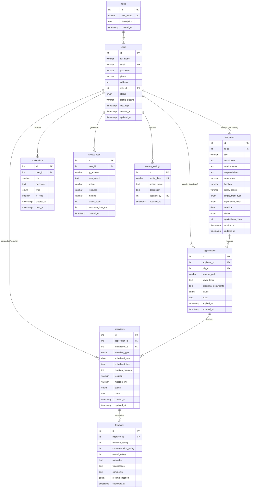
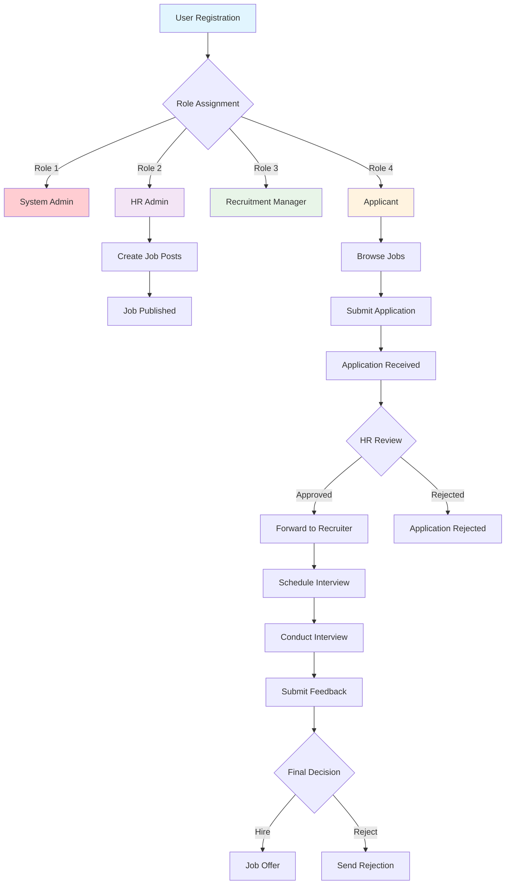
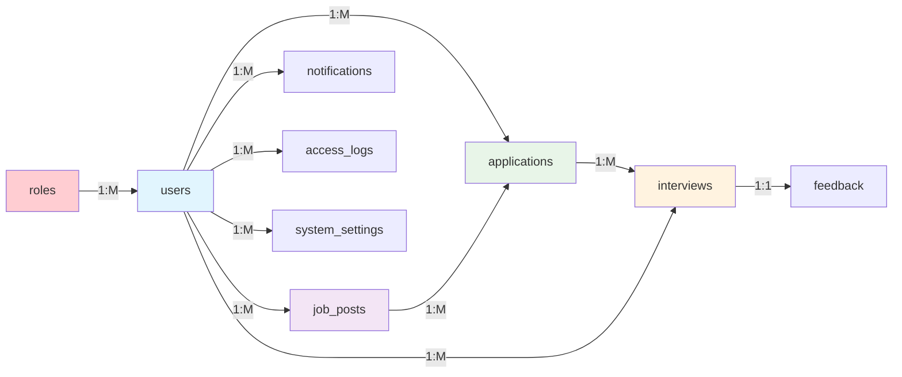

# Database Documentation

## Default Test Accounts
```
System Admin: admin@hireflow.com / Password@1
HR Admin: hr@hireflow.com / Password@1  
Recruitment Manager: recruiter@hireflow.com / Password@1
Applicant: athsara@hireflow.com / Password@1
```

## Overview
HireFlow uses a MySQL database with a normalized schema designed for efficient recruitment management. The database supports role-based access control, application tracking, and comprehensive audit logging.

## Quick Setup
```bash
# Option 1: Import complete database backup (RECOMMENDED)
# See Database-Backup/SETUP_GUIDE.md for detailed instructions
# Import Database-Backup/hireflow_db.sql using phpMyAdmin or command line

# Option 2: Build from schema
mysql -u root -p < database_schema.sql

# Option 3: Add additional test data (optional)
mysql -u root -p hireflow_db < dummy_data.sql

# Or use phpMyAdmin to import these files in order
```

**Files:**
- `Database-Backup/hireflow_db.sql` - **Complete database backup with all data** (recommended)
- `Database-Backup/SETUP_GUIDE.md` - **Detailed import instructions**
- `Database-Backup/DATABASE_SCHEMA.md` - **Complete schema documentation**
- `database_schema.sql` - Database structure + default users
- `dummy_data.sql` - Additional test data (70+ records) including:
  - 11 realistic job postings across 8 departments  
  - 10 job applications with detailed cover letters
  - Interview schedules and system notifications
  - Access logs and system configuration settings

## Entity Relationship Diagram (EER)



## Database Schema Flow



## Database Schema

### Tables Overview
1. **roles** - User role definitions
2. **users** - User accounts and profiles  
3. **job_posts** - Job postings and requirements
4. **applications** - Job applications from candidates
5. **interviews** - Interview scheduling and management
6. **feedback** - Interview feedback and evaluations
7. **notifications** - System notifications for users
8. **access_logs** - Security and audit logging
9. **system_settings** - Configurable system parameters

### Entity Relationships



## Table Details

### 1. roles
**Purpose**: Defines user roles and permissions
```sql
CREATE TABLE roles (
    id INT AUTO_INCREMENT PRIMARY KEY,
    role_name VARCHAR(50) NOT NULL UNIQUE,
    description TEXT,
    created_at TIMESTAMP DEFAULT CURRENT_TIMESTAMP
);
```

**Data**:
- 1: System Admin - Full system access
- 2: HR Admin - Job and recruitment management
- 3: Recruitment Manager - Interview and evaluation
- 4: Applicant - Job browsing and applications

### 2. users
**Purpose**: User accounts with role-based access
```sql
CREATE TABLE users (
    id INT AUTO_INCREMENT PRIMARY KEY,
    full_name VARCHAR(100) NOT NULL,
    email VARCHAR(100) NOT NULL UNIQUE,
    password VARCHAR(255) NOT NULL,  -- Hashed passwords
    phone VARCHAR(20),
    address TEXT,
    role_id INT NOT NULL,
    status ENUM('active', 'inactive', 'suspended') DEFAULT 'active',
    profile_picture VARCHAR(255),
    last_login TIMESTAMP NULL,
    created_at TIMESTAMP DEFAULT CURRENT_TIMESTAMP,
    updated_at TIMESTAMP DEFAULT CURRENT_TIMESTAMP ON UPDATE CURRENT_TIMESTAMP,
    FOREIGN KEY (role_id) REFERENCES roles(id)
);
```

**Indexes**: email, role_id+status for performance

### 3. job_posts  
**Purpose**: Job postings created by HR Admins
```sql
CREATE TABLE job_posts (
    id INT AUTO_INCREMENT PRIMARY KEY,
    hr_id INT NOT NULL,  -- HR Admin who created the job
    title VARCHAR(200) NOT NULL,
    description TEXT NOT NULL,
    requirements TEXT,
    responsibilities TEXT,
    department VARCHAR(100),
    location VARCHAR(100), 
    salary_range VARCHAR(100),
    employment_type ENUM('Full-time', 'Part-time', 'Contract', 'Internship'),
    experience_level ENUM('Entry', 'Mid', 'Senior', 'Executive'),
    deadline DATE,
    status ENUM('Open', 'Closed', 'Draft') DEFAULT 'Draft',
    applications_count INT DEFAULT 0,
    created_at TIMESTAMP DEFAULT CURRENT_TIMESTAMP,
    updated_at TIMESTAMP DEFAULT CURRENT_TIMESTAMP ON UPDATE CURRENT_TIMESTAMP,
    FOREIGN KEY (hr_id) REFERENCES users(id)
);
```

### 4. applications
**Purpose**: Job applications submitted by applicants
```sql
CREATE TABLE applications (
    id INT AUTO_INCREMENT PRIMARY KEY,
    applicant_id INT NOT NULL,
    job_id INT NOT NULL,
    resume_path VARCHAR(255) NOT NULL,
    cover_letter TEXT,
    additional_documents TEXT,
    status ENUM('Applied', 'Under Review', 'Shortlisted', 'Interview Scheduled', 
                'Interview Completed', 'Rejected', 'Offered', 'Hired') DEFAULT 'Applied',
    notes TEXT,
    applied_at TIMESTAMP DEFAULT CURRENT_TIMESTAMP,
    updated_at TIMESTAMP DEFAULT CURRENT_TIMESTAMP ON UPDATE CURRENT_TIMESTAMP,
    UNIQUE KEY unique_application (applicant_id, job_id),
    FOREIGN KEY (applicant_id) REFERENCES users(id),
    FOREIGN KEY (job_id) REFERENCES job_posts(id)
);
```

**Constraint**: One application per user per job (unique_application)

### 5. interviews
**Purpose**: Interview scheduling and management
```sql
CREATE TABLE interviews (
    id INT AUTO_INCREMENT PRIMARY KEY,
    application_id INT NOT NULL,
    interviewer_id INT NOT NULL,  -- Recruitment Manager
    interview_type ENUM('Phone', 'Video', 'In-person', 'Panel') DEFAULT 'Video',
    scheduled_date DATE NOT NULL,
    scheduled_time TIME NOT NULL,
    duration_minutes INT DEFAULT 60,
    location VARCHAR(255),
    meeting_link VARCHAR(500),
    status ENUM('Scheduled', 'Completed', 'Canceled', 'Rescheduled') DEFAULT 'Scheduled',
    notes TEXT,
    created_at TIMESTAMP DEFAULT CURRENT_TIMESTAMP,
    updated_at TIMESTAMP DEFAULT CURRENT_TIMESTAMP ON UPDATE CURRENT_TIMESTAMP,
    FOREIGN KEY (application_id) REFERENCES applications(id),
    FOREIGN KEY (interviewer_id) REFERENCES users(id)
);
```

### 6. feedback
**Purpose**: Interview feedback and candidate evaluations
```sql
CREATE TABLE feedback (
    id INT AUTO_INCREMENT PRIMARY KEY,
    interview_id INT NOT NULL,
    technical_rating INT CHECK (technical_rating BETWEEN 1 AND 10),
    communication_rating INT CHECK (communication_rating BETWEEN 1 AND 10),
    overall_rating INT CHECK (overall_rating BETWEEN 1 AND 10),
    strengths TEXT,
    weaknesses TEXT,
    comments TEXT,
    recommendation ENUM('Strongly Recommend', 'Recommend', 'Neutral', 
                        'Do Not Recommend', 'Strongly Do Not Recommend'),
    submitted_at TIMESTAMP DEFAULT CURRENT_TIMESTAMP,
    FOREIGN KEY (interview_id) REFERENCES interviews(id)
);
```

### 7. notifications
**Purpose**: System notifications for users
```sql
CREATE TABLE notifications (
    id INT AUTO_INCREMENT PRIMARY KEY,
    user_id INT NOT NULL,
    title VARCHAR(200) NOT NULL,
    message TEXT NOT NULL,
    type ENUM('info', 'success', 'warning', 'error') DEFAULT 'info',
    is_read BOOLEAN DEFAULT FALSE,
    created_at TIMESTAMP DEFAULT CURRENT_TIMESTAMP,
    read_at TIMESTAMP NULL,
    FOREIGN KEY (user_id) REFERENCES users(id)
);
```

### 8. access_logs
**Purpose**: Security audit trail and system monitoring
```sql
CREATE TABLE access_logs (
    id INT AUTO_INCREMENT PRIMARY KEY,
    user_id INT NULL,  -- NULL for failed login attempts
    ip_address VARCHAR(45),
    user_agent TEXT,
    action VARCHAR(255) NOT NULL,
    resource VARCHAR(255),
    method VARCHAR(10),
    status_code INT,
    response_time_ms INT,
    created_at TIMESTAMP DEFAULT CURRENT_TIMESTAMP,
    FOREIGN KEY (user_id) REFERENCES users(id)
);
```

### 9. system_settings
**Purpose**: Configurable system parameters
```sql
CREATE TABLE system_settings (
    id INT AUTO_INCREMENT PRIMARY KEY,
    setting_key VARCHAR(100) NOT NULL UNIQUE,
    setting_value TEXT,
    description TEXT,
    updated_by INT,
    updated_at TIMESTAMP DEFAULT CURRENT_TIMESTAMP ON UPDATE CURRENT_TIMESTAMP,
    FOREIGN KEY (updated_by) REFERENCES users(id)
);
```

## Sample Data

### Default Users
```
System Admin: admin@hireflow.com / Password@1
HR Admin: hr@hireflow.com / Password@1
Recruitment Manager: recruiter@hireflow.com / Password@1
Applicant: athsara@hireflow.com / Password@1
```

### Sample Job Posts
- Senior Software Engineer (IT Department)
- Marketing Specialist (Marketing Department)
- Junior Data Analyst (Analytics Department)
- HR Assistant (Human Resources)
- Project Manager (Management)

## Database Operations

### User Management
```sql
-- Create new user
INSERT INTO users (full_name, email, password, role_id) 
VALUES ('Name', 'email@domain.com', 'hashed_password', role_id);

-- Update user role
UPDATE users SET role_id = new_role_id WHERE id = user_id;

-- Deactivate user
UPDATE users SET status = 'inactive' WHERE id = user_id;
```

### Application Workflow
```sql
-- Application submission
INSERT INTO applications (applicant_id, job_id, resume_path, cover_letter)
VALUES (applicant_id, job_id, 'resume_path', 'cover_letter');

-- Update application status
UPDATE applications SET status = 'Shortlisted' WHERE id = application_id;

-- Schedule interview
INSERT INTO interviews (application_id, interviewer_id, scheduled_date, scheduled_time)
VALUES (application_id, interviewer_id, 'date', 'time');
```

### Reporting Queries
```sql
-- Applications by status
SELECT status, COUNT(*) as count FROM applications GROUP BY status;

-- Jobs by department
SELECT department, COUNT(*) as job_count FROM job_posts GROUP BY department;

-- User activity
SELECT COUNT(*) as login_count FROM access_logs 
WHERE action = 'User login' AND DATE(created_at) = CURDATE();
```

## Performance Optimization

### Indexes
- Primary keys on all tables
- Foreign key indexes for joins
- Composite indexes for common queries
- Email index for user lookups

### Query Optimization
- Use prepared statements
- Implement pagination for large datasets
- Cache frequently accessed data
- Optimize JOIN operations

## Backup & Maintenance

### Regular Backups
```bash
# Full database backup
mysqldump -u root -p hireflow_db > backup_$(date +%Y%m%d).sql

# Table-specific backup
mysqldump -u root -p hireflow_db users > users_backup.sql
```

### Maintenance Tasks
- Regular log cleanup for access_logs table
- Archive old applications and interviews
- Monitor database size and performance
- Update statistics for query optimization

## Security Considerations

### Data Protection
- Passwords are hashed using PHP's password_hash()
- Sensitive data encryption for PII
- Regular security audits
- Access logging for compliance

### Backup Security
- Encrypted backup storage
- Secure backup transmission
- Regular backup testing
- Offsite backup storage

## Troubleshooting

### Common Issues
1. **Foreign key constraints**: Ensure referenced records exist
2. **Duplicate entries**: Check unique constraints
3. **Performance issues**: Analyze slow queries and add indexes
4. **Data integrity**: Regularly check for orphaned records

### Monitoring
- Monitor database size and growth
- Track query performance
- Monitor connection usage
- Review access logs for security issues
