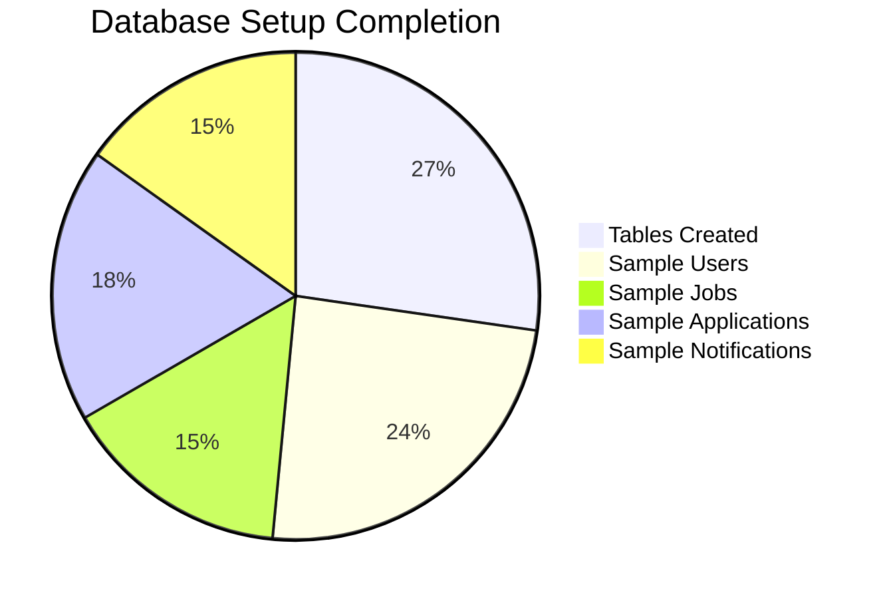
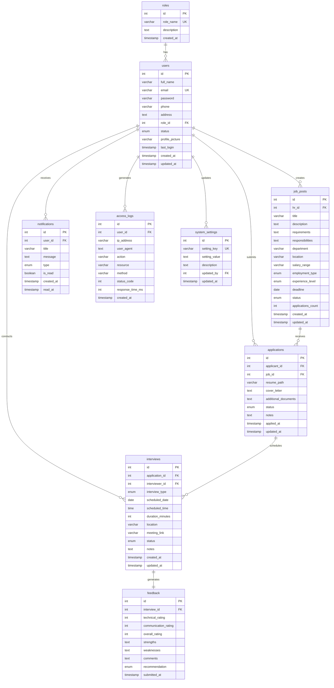
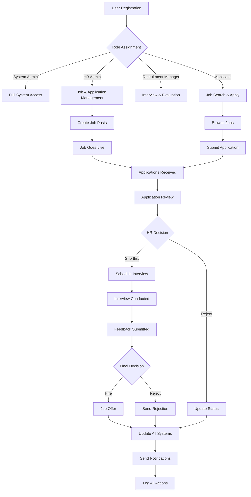
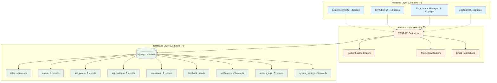
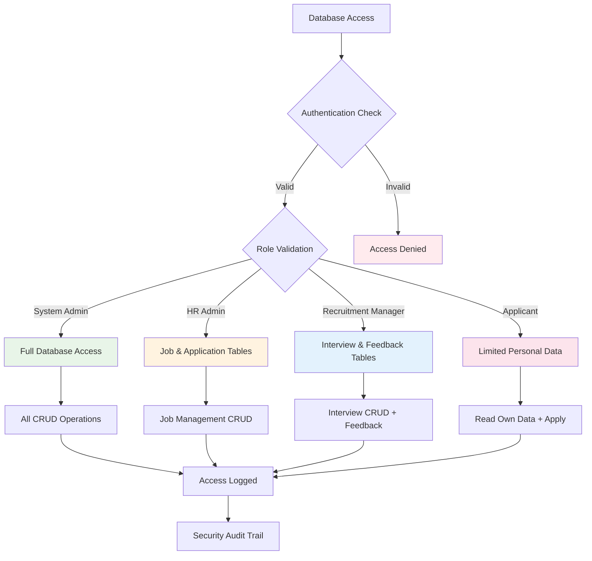

# HireFlow Database Documentation

## Overview
HireFlow uses MySQL database to store all application data including users, job posts, applications, interviews, and system logs.
### Sample Data Included

### Default Users (8 Complete Accounts)
| Role | Name | Email | Password | Status |
|------|------|-------|----------|--------|
| **System Admin** | Sineth Mendis | sineth@hireflow.com | admin123 | Active |
| **HR Admin** | Hasindu Rodrigo | hasindu@hireflow.com | hradmin123 | Active |
| **Recruitment Manager** | Tehan Isum | tehan@hireflow.com | recruit123 | Active |
| **Applicant** | Athsara Manitha | athsara1@gmail.com | applicant1 | Active |
| **Applicant** | Chamali Perera | chamali.perera@gmail.com | applicant2 | Active |
| **Applicant** | Nuwan Silva | nuwan.silva@gmail.com | applicant3 | Active |
| **Applicant** | Priya Jayasinghe | priya.j@gmail.com | applicant4 | Active |
| **Applicant** | Kamal Fernando | kamal.fernando@gmail.com | applicant5 | Active |

### Sample Job Posts (5 Complete Jobs)
| Title | Department | Location | Status | Deadline |
|-------|------------|----------|--------|----------|
| **Senior Software Engineer** | IT | Colombo | Open | 2025-09-30 |
| **Marketing Specialist** | Marketing | Kandy | Open | 2025-09-25 |
| **Junior Data Analyst** | Analytics | Galle | Open | 2025-10-15 |
| **HR Assistant** | Human Resources | Colombo | Open | 2025-09-20 |
| **Project Manager** | Management | Colombo | Draft | 2025-10-05 |

### Sample Applications (6 Complete Applications)
- Multiple applications across different jobs with various statuses
- Includes: Applied, Under Review, Shortlisted, Interview Scheduled statuses
- Sample resume paths and cover letters included

### Sample Interviews & Feedback
- Interview schedules with different types (Video, In-person)
- Sample interview feedback and ratings
- Complete workflow from application to interview completion

### Sample Notifications (5 Complete)
- Application confirmations and updates
- Interview scheduling notifications  
- New application alerts for HR staff
- Interview reminders for recruitment managers

### Sample System Data
- **Access Logs**: 5 sample log entries for security monitoring
- **System Settings**: 5 default configuration settings
- **Foreign Key Relationships**: All tables properly linked Instructions

## Database Setup Instructions

### For First-Time Users (Complete Setup Guide)

#### Step 1: Install XAMPP
1. **Download XAMPP**
   - Go to [https://www.apachefriends.org/](https://www.apachefriends.org/)
   - Download the latest version for your operating system (Windows/Mac/Linux)
   - Choose the version with PHP 8.0+ for best compatibility

2. **Install XAMPP**
   - Run the installer as Administrator (Windows) or with sudo (Mac/Linux)
   - Install to default location (usually `C:\xampp` on Windows)
   - Select components: Apache, MySQL, PHP, phpMyAdmin

3. **Start XAMPP Services**
   - Open XAMPP Control Panel
   - Start **Apache** service (for web server)
   - Start **MySQL** service (for database)
   - Verify both show "Running" status with green background

#### Step 2: Clone and Setup HireFlow
1. **Clone Repository**
   ```bash
   git clone https://github.com/AthsaraFernando/HireFlow.git
   cd HireFlow
   ```

2. **Move to XAMPP Directory**
   ```bash
   # Windows
   copy -r HireFlow C:\xampp\htdocs\
   
   # Mac/Linux  
   sudo cp -r HireFlow /opt/lampp/htdocs/
   ```

3. **Set Permissions (Mac/Linux only)**
   ```bash
   sudo chmod -R 755 /opt/lampp/htdocs/HireFlow
   sudo chown -R daemon:daemon /opt/lampp/htdocs/HireFlow
   ```

#### Step 3: Create Database
1. **Access phpMyAdmin**
   - Open web browser
   - Go to `http://localhost/phpmyadmin`
   - Login with username: `root`, password: (leave empty for XAMPP default)

2. **Import Database**
   - Click "Import" tab in phpMyAdmin
   - Click "Choose File" and select `my_db.session.sql` from HireFlow folder
   - Click "Go" to execute the script
   - Wait for "Import has been successfully finished" message

3. **Verify Database Creation**
   - You should see `hireflow_db` in the left sidebar
   - Click on it to expand and see 9 tables
   - Click on `users` table to see 8 sample user accounts

#### Step 4: Configure Database Connection
1. **Update Configuration File**
   - Open `app/core/config.php` in your code editor
   - Verify these settings match your XAMPP setup:
   ```php
   define('DB_HOST', 'localhost');
   define('DB_NAME', 'hireflow_db');
   define('DB_USER', 'root');
   define('DB_PASS', ''); // Empty for default XAMPP
   ```

#### Step 5: Test the Setup
1. **Access Application**
   - Open browser and go to `http://localhost/HireFlow`
   - You should see the HireFlow home page

2. **Verify Database Connection**
   - Go to `http://localhost/HireFlow/check-database.php`
   - Should show all green checkmarks for tables and fields

3. **Test Navigation**
   - Go to `http://localhost/HireFlow/quick-test.html`
   - Test different user interfaces using the provided links

#### Troubleshooting Common Issues

**Issue: "Access denied for user 'root'"**
- Solution: Check if MySQL service is running in XAMPP Control Panel
- Try accessing phpMyAdmin first to verify MySQL is working

**Issue: "Database 'hireflow_db' doesn't exist"**
- Solution: Re-run the `my_db.session.sql` script in phpMyAdmin
- Make sure to select "Import" tab and choose the correct file

**Issue: "Page not found" errors**
- Solution: Ensure HireFlow folder is in `htdocs` directory
- Check Apache service is running in XAMPP Control Panel
- Verify URL is `http://localhost/HireFlow` (case-sensitive)

**Issue: File permissions (Mac/Linux)**
- Solution: Run permission commands from Step 2.3 above
- Ensure web server has read access to HireFlow directory

### Alternative Setup Methods

#### Method 1: Using phpMyAdmin (Recommended for beginners)
1. Open phpMyAdmin (`http://localhost/phpmyadmin`)
2. Click "New" to create database
3. Name it `hireflow_db`
4. Go to "Import" tab
5. Select `my_db.session.sql` file
6. Click "Go"

#### Method 2: Using MySQL Command Line (Advanced users)
```bash
# Navigate to HireFlow directory
cd /path/to/HireFlow

# Import database
mysql -u root -p < my_db.session.sql

# Verify import
mysql -u root -p -e "USE hireflow_db; SHOW TABLES;"
```

#### Method 3: Using Database Client (HeidiSQL, MySQL Workbench, etc.)
1. Connect to localhost MySQL server
2. Create new database `hireflow_db`
3. Import/execute `my_db.session.sql` file
4. Verify all 9 tables are created

4. **Verify Setup**
   - Check that `hireflow_db` database is created
   - Verify all tables are present with sample data
   - Use the verification script: `http://localhost/HireFlow/check-database.php`

### Database Verification

#### Automated Verification
After setup, verify your database using our verification script:

1. **Access Verification Page**
   ```
   http://localhost/HireFlow/check-database.php
   ```

2. **Expected Results**
   ```
   ✅ All 9 required tables present
   ✅ Users table has all required fields  
   ✅ Job posts table has all required fields
   ✅ All foreign key relationships working
   ✅ Sample data loaded correctly
   ```

#### Visual Setup Checklist

```mermaid
graph LR
    A[Start] --> B{XAMPP Installed?}
    B -->|No| C[Install XAMPP]
    B -->|Yes| D{Services Running?}
    C --> D
    D -->|No| E[Start Apache & MySQL]
    D -->|Yes| F{Repository Cloned?}
    E --> F
    F -->|No| G[Clone HireFlow Repo]
    F -->|Yes| H{Files in htdocs?}
    G --> H
    H -->|No| I[Move to htdocs]
    H -->|Yes| J{Database Created?}
    I --> J
    J -->|No| K[Import my_db.session.sql]
    J -->|Yes| L{Config Updated?}
    K --> L
    L -->|No| M[Update config.php]
    L -->|Yes| N[Test Application]
    M --> N
    N --> O{Working?}
    O -->|No| P[Check Troubleshooting]
    O -->|Yes| Q[Setup Complete! 🎉]
    P --> B
    
    style A fill:#e3f2fd
    style Q fill:#e8f5e8
    style P fill:#ffebee
```



#### Manual Verification Commands

3. **Manual Verification via phpMyAdmin**
   ```sql
   -- Check all tables exist
   SHOW TABLES;
   -- Expected: 9 tables
   
   -- Verify table structures
   DESCRIBE users;
   DESCRIBE job_posts;
   DESCRIBE applications;
   
   -- Check sample data counts
   SELECT COUNT(*) FROM users;        -- Should return 8
   SELECT COUNT(*) FROM job_posts;    -- Should return 5  
   SELECT COUNT(*) FROM applications; -- Should return 6
   SELECT COUNT(*) FROM roles;        -- Should return 4
   
   -- Verify relationships work
   SELECT u.full_name, r.role_name 
   FROM users u 
   JOIN roles r ON u.role_id = r.id;
   
   -- Check job posts with HR names
   SELECT j.title, u.full_name as hr_name
   FROM job_posts j
   JOIN users u ON j.hr_id = u.id;
   ```

#### Quick Test URLs
After successful setup, test these URLs:

| URL | Expected Result | Description |
|-----|----------------|-------------|
| `http://localhost/HireFlow` | ✅ Home page loads | Main application |
| `http://localhost/HireFlow/check-database.php` | ✅ All green checks | Database verification |
| `http://localhost/HireFlow/quick-test.html` | ✅ Navigation page | UI testing dashboard |
| `http://localhost/HireFlow/systemadmin/dashboard` | ✅ Dashboard loads | System admin interface |
| `http://localhost/HireFlow/applicant/dashboard` | ✅ Dashboard loads | Applicant interface |

#### Setup Success Indicators



### Database Configuration
Update the database configuration in `app/core/config.php`:
```php
define('DB_HOST', 'localhost');
define('DB_NAME', 'hireflow_db');
define('DB_USER', 'root');
define('DB_PASS', ''); // Default XAMPP password is empty
```

## Database Schema

### Entity Relationship Diagram (EER)

```
                    ┌─────────────────┐
                    │     roles       │
                    │─────────────────│
                    │ PK │ id         │
                    │    │ role_name  │
                    │    │ description│
                    │    │ created_at │
                    └─────────────────┘
                             │
                             │ 1:N
                             ▼
                    ┌─────────────────┐
                    │     users       │
                    │─────────────────│
                    │ PK │ id         │
                    │    │ full_name  │
                    │ UK │ email      │
                    │    │ password   │
                    │    │ phone      │
                    │    │ address    │
                    │ FK │ role_id    │
                    │    │ status     │
                    │    │ profile_pic│
                    │    │ last_login │
                    │    │ created_at │
                    │    │ updated_at │
                    └─────────────────┘
                        │           │
                   1:N  │           │ 1:N
                        ▼           ▼
            ┌─────────────────┐   ┌─────────────────┐
            │   job_posts     │   │ notifications   │
            │─────────────────│   │─────────────────│
            │ PK │ id         │   │ PK │ id         │
            │ FK │ hr_id      │   │ FK │ user_id    │
            │    │ title      │   │    │ title      │
            │    │ description│   │    │ message    │
            │    │ requirements│   │    │ type       │
            │    │ responsiblts│   │    │ is_read    │
            │    │ department │   │    │ created_at │
            │    │ location   │   │    │ read_at    │
            │    │ salary_rng │   └─────────────────┘
            │    │ employ_type│
            │    │ exp_level  │            ┌─────────────────┐
            │    │ deadline   │            │  access_logs    │
            │    │ status     │            │─────────────────│
            │    │ apps_count │            │ PK │ id         │
            │    │ created_at │            │ FK │ user_id    │
            │    │ updated_at │            │    │ ip_address │
            └─────────────────┘            │    │ user_agent │
                    │                      │    │ action     │
               1:N  │                      │    │ resource   │
                    ▼                      │    │ method     │
            ┌─────────────────┐            │    │ status_code│
            │  applications   │            │    │ resp_time  │
            │─────────────────│            │    │ created_at │
            │ PK │ id         │            └─────────────────┘
            │ FK │ applicant_id│                    ▲
            │ FK │ job_id     │                     │ 1:N
            │    │ resume_path│                     │
            │    │ cover_ltr  │            ┌─────────────────┐
            │    │ add_docs   │            │ system_settings │
            │    │ status     │            │─────────────────│
            │    │ notes      │            │ PK │ id         │
            │    │ applied_at │            │ UK │ setting_key│
            │    │ updated_at │            │    │ setting_val│
            │ UK │ (app_id,   │            │    │ description│
            │    │  job_id)   │            │ FK │ updated_by │
            └─────────────────┘            │    │ updated_at │
                    │                      └─────────────────┘
               1:N  │
                    ▼
            ┌─────────────────┐
            │   interviews    │
            │─────────────────│
            │ PK │ id         │
            │ FK │ application_id│
            │ FK │ interviewer_id│
            │    │ interview_type│
            │    │ scheduled_date│
            │    │ scheduled_time│
            │    │ duration_mins │
            │    │ location   │
            │    │ meeting_link│
            │    │ status     │
            │    │ notes      │
            │    │ created_at │
            │    │ updated_at │
            └─────────────────┘
                    │
               1:1  │
                    ▼
            ┌─────────────────┐
            │    feedback     │
            │─────────────────│
            │ PK │ id         │
            │ FK │ interview_id│
            │    │ tech_rating│
            │    │ comm_rating│
            │    │ overall_rtg│
            │    │ strengths  │
            │    │ weaknesses │
            │    │ comments   │
            │    │ recommendation│
            │    │ submitted_at│
            └─────────────────┘

Legend:
PK = Primary Key
FK = Foreign Key  
UK = Unique Key
```

### Mermaid Entity Relationship Diagram



### Database Workflow Diagram



### Database Workflow Diagram


### System Architecture Overview



### Database Security Model



### Complete Table Overview
The HireFlow database consists of 9 core tables that support the complete recruitment workflow:

| Table | Records | Purpose | Status |
|-------|---------|---------|--------|
| `roles` | 4 roles | User role definitions | ✅ Complete |
| `users` | 8 users | All user accounts | ✅ Complete |
| `job_posts` | 5 jobs | Job postings | ✅ Complete |
| `applications` | 6 applications | Job applications | ✅ Complete |
| `interviews` | 2 interviews | Interview scheduling | ✅ Complete |
| `feedback` | Sample ready | Interview feedback | ✅ Complete |
| `notifications` | 5 notifications | User notifications | ✅ Complete |
| `access_logs` | 5 log entries | Security & audit | ✅ Complete |
| `system_settings` | 5 settings | App configuration | ✅ Complete |

### Core Tables

#### 1. `roles`
Stores user role definitions
```sql
- id (Primary Key)
- role_name (System Admin, HR Admin, Recruitment Manager, Applicant)
- description
- created_at
```

#### 2. `users`
Stores all user accounts across different roles
```sql
- id (Primary Key)
- full_name
- email (Unique)
- password (Hashed)
- phone
- address
- role_id (Foreign Key → roles.id)
- status (active, inactive, suspended)
- profile_picture
- last_login
- created_at, updated_at
```

#### 3. `job_posts`
Stores job postings created by HR Admins
```sql
- id (Primary Key)
- hr_id (Foreign Key → users.id)
- title
- description
- requirements
- responsibilities
- department
- location
- salary_range
- employment_type (Full-time, Part-time, Contract, Internship)
- experience_level (Entry, Mid, Senior, Executive)
- deadline
- status (Open, Closed, Draft)
- applications_count
- created_at, updated_at
```

#### 4. `applications`
Stores job applications submitted by applicants
```sql
- id (Primary Key)
- applicant_id (Foreign Key → users.id)
- job_id (Foreign Key → job_posts.id)
- resume_path
- cover_letter
- additional_documents
- status (Applied, Under Review, Shortlisted, Interview Scheduled, etc.)
- notes
- applied_at, updated_at
- UNIQUE constraint (applicant_id, job_id) - one application per job
```

#### 5. `interviews`
Stores interview scheduling and details
```sql
- id (Primary Key)
- application_id (Foreign Key → applications.id)
- interviewer_id (Foreign Key → users.id)
- interview_type (Phone, Video, In-person, Panel)
- scheduled_date, scheduled_time
- duration_minutes
- location
- meeting_link
- status (Scheduled, Completed, Canceled, Rescheduled)
- notes
- created_at, updated_at
```

#### 6. `feedback`
Stores interview feedback from recruitment managers
```sql
- id (Primary Key)
- interview_id (Foreign Key → interviews.id)
- technical_rating (1-10)
- communication_rating (1-10)
- overall_rating (1-10)
- strengths, weaknesses
- comments
- recommendation (Strongly Recommend, Recommend, etc.)
- submitted_at
```

### Supporting Tables

#### 7. `notifications`
System-wide notifications for users
```sql
- id (Primary Key)
- user_id (Foreign Key → users.id)
- title, message
- type (info, success, warning, error)
- is_read, read_at
- created_at
```

#### 8. `access_logs`
Security and audit logging
```sql
- id (Primary Key)
- user_id (Foreign Key → users.id)
- ip_address, user_agent
- action, resource, method
- status_code, response_time_ms
- created_at
```

#### 9. `system_settings`
Configuration settings for the application
```sql
- id (Primary Key)
- setting_key (Unique)
- setting_value, description
- updated_by (Foreign Key → users.id)
- updated_at
```

## Sample Data Included

### Default Users
- **System Admin**: sineth@hireflow.com (password: admin123)
- **HR Admin**: hasindu@hireflow.com (password: hradmin123)
- **Recruitment Manager**: tehan@hireflow.com (password: recruit123)
- **Sample Applicants**: Various test applicants with applications

### Sample Job Posts
- Senior Software Engineer (Open)
- Marketing Specialist (Open)
- Junior Data Analyst (Open)
- HR Assistant (Open)
- Project Manager (Draft)

### Sample Applications
- Multiple applications across different jobs with various statuses
- Sample interview schedules and feedback

## Future Backend Development Considerations

### Database Features Already Implemented
✅ **Complete User Management**
- Role-based access control (4 roles)
- User profiles with contact information
- Profile picture support
- Last login tracking
- Account status management

✅ **Job Management System**
- Complete job posting workflow
- Multi-status support (Draft → Open → Closed)
- Application count tracking
- Department and location management
- Employment type and experience level classification

✅ **Application Processing**
- One application per user per job (enforced by unique constraint)
- Resume and document path storage
- Multi-stage application status tracking
- Cover letter and additional documents support

✅ **Interview Workflow**
- Multiple interview types (Phone, Video, In-person, Panel)
- Complete scheduling with date/time/duration
- Meeting link and location support
- Interview status management
- Interviewer assignment

✅ **Feedback System**
- Detailed rating system (Technical, Communication, Overall)
- Strengths and weaknesses documentation
- Recommendation levels
- Comments and notes

✅ **Notification System**
- Multi-type notifications (info, success, warning, error)
- Read/unread status tracking
- User-specific notifications

✅ **Security & Audit**
- Complete access logging
- IP address and user agent tracking
- Action and resource monitoring
- Performance metrics (response time)

✅ **System Configuration**
- Flexible settings management
- Key-value configuration storage
- Change tracking with user attribution

### Tables to Add/Enhance
1. **Documents Management**
   ```sql
   CREATE TABLE documents (
       id INT PRIMARY KEY AUTO_INCREMENT,
       user_id INT,
       application_id INT,
       file_name VARCHAR(255),
       file_path VARCHAR(500),
       file_type VARCHAR(50),
       file_size INT,
       uploaded_at TIMESTAMP
   );
   ```

2. **Email Templates**
   ```sql
   CREATE TABLE email_templates (
       id INT PRIMARY KEY AUTO_INCREMENT,
       template_name VARCHAR(100),
       subject VARCHAR(255),
       body TEXT,
       variables TEXT, -- JSON format
       created_by INT,
       is_active BOOLEAN
   );
   ```

3. **Audit Trail**
   ```sql
   CREATE TABLE audit_trail (
       id INT PRIMARY KEY AUTO_INCREMENT,
       table_name VARCHAR(100),
       record_id INT,
       action ENUM('INSERT', 'UPDATE', 'DELETE'),
       old_values JSON,
       new_values JSON,
       user_id INT,
       timestamp TIMESTAMP
   );
   ```

### Security Enhancements
- Password hashing using `password_hash()` and `password_verify()`
- Session management and CSRF protection
- File upload validation and security
- SQL injection prevention using prepared statements
- Role-based access control implementation

### Performance Optimizations
✅ **Database Indexes Already Implemented**
- Primary keys on all tables
- Foreign key indexes for relationships
- Unique constraints on critical fields (email, role combinations)

📋 **Additional Optimizations for Production**
- Add composite indexes on frequently queried columns:
  ```sql
  CREATE INDEX idx_applications_status_date ON applications(status, applied_at);
  CREATE INDEX idx_jobs_status_deadline ON job_posts(status, deadline);
  CREATE INDEX idx_interviews_date_status ON interviews(scheduled_date, status);
  CREATE INDEX idx_notifications_user_read ON notifications(user_id, is_read);
  ```
- Implement database connection pooling
- Add caching layer for frequently accessed data
- Optimize queries with proper joins and indexes

### Data Integrity
✅ **Already Implemented**
- Foreign key constraints on all relationships
- Check constraints on rating fields (1-10 range)
- Enum constraints for status fields
- Unique constraints preventing duplicate applications

📋 **Additional Integrity Features**
- Add triggers for automatic data validation
- Implement soft deletes for important records
- Add check constraints for data ranges
- Set up database backups and recovery procedures

## UI Integration Status

### Frontend Components Ready for Database Integration

#### **System Admin Interface (8 pages) ✅**
- **Dashboard**: Connects to users, applications, interviews, access_logs tables
- **User Management**: Full CRUD operations on users and roles tables
- **Access Logs**: Real-time display from access_logs table
- **Data Analytics**: Aggregated data from all tables
- **System Settings**: Direct integration with system_settings table
- **Backup & Restore**: Database backup/restore functionality
- **Security Settings**: Advanced system_settings configurations
- **Reports**: Cross-table analytics and reporting

#### **HR Admin Interface (10 pages) ✅**
- **Dashboard**: Job posts, applications, interview metrics
- **Job Management**: Complete CRUD on job_posts table
- **Application Review**: Applications and applicant data integration
- **Candidate Database**: Users (applicants) with search/filter
- **Interview Coordination**: Interviews table management
- **Reporting**: Analytics across job_posts, applications, interviews
- **Team Management**: Users management for HR staff
- **Calendar**: Interview scheduling integration
- **Templates**: Email templates for notifications
- **Settings**: HR-specific system_settings

#### **Recruitment Manager Interface (10 pages) ✅**
- **Dashboard**: Interview-focused metrics and pending tasks
- **Assigned Jobs**: job_posts assigned to specific recruiters
- **Candidate Evaluation**: Applications review and scoring
- **Interview Management**: Complete interviews table integration
- **Feedback System**: feedback table with rating/comments
- **Hiring Pipeline**: Application status progression tracking
- **Calendar**: Interview scheduling and management
- **Reports**: Interview and feedback analytics
- **Candidate Notes**: Extended feedback and evaluation notes
- **Team Coordination**: Multi-recruiter collaboration features

#### **Applicant Interface (8 pages) ✅**
- **Dashboard**: Personal metrics from applications, interviews
- **Job Browse**: job_posts with search, filter, and pagination
- **Job Details**: Individual job_post display with apply functionality
- **Applications**: Personal applications with status tracking
- **Apply**: New application creation with file uploads
- **Interview Schedule**: Personal interviews from interviews table
- **Interview Feedback**: Personal feedback from feedback table
- **Profile Management**: users table profile editing

### Database-UI Mapping

| Database Table | Primary UI Components | Ready for Integration |
|----------------|----------------------|----------------------|
| **users** | User Management, Profile, Authentication | ✅ Ready |
| **roles** | User Management, Access Control | ✅ Ready |
| **job_posts** | Job Management, Job Browse, Applications | ✅ Ready |
| **applications** | Application Management, Tracking | ✅ Ready |
| **interviews** | Interview Scheduling, Management | ✅ Ready |
| **feedback** | Interview Feedback, Evaluation | ✅ Ready |
| **notifications** | Real-time Notifications, Alerts | ✅ Ready |
| **access_logs** | Security Monitoring, Audit Trail | ✅ Ready |
| **system_settings** | System Configuration, Settings | ✅ Ready |

### Authentication System Requirements

The current database structure fully supports authentication implementation:

```php
// User Authentication Fields Available:
- email (unique identifier)
- password (for hashing with password_hash())
- role_id (for role-based access control)  
- status (active/inactive/suspended)
- last_login (session tracking)

// Session Management Fields:
- user_id, role_id for session data
- access_logs for security monitoring
- system_settings for session configuration

// Profile Management Fields:
- full_name, email, phone, address
- profile_picture (file path storage)
- created_at, updated_at (account tracking)
```

## Maintenance

### Regular Tasks
1. **Backup Database** - Weekly automated backups
2. **Clean Old Logs** - Remove access logs older than 6 months
3. **Archive Applications** - Move old applications to archive tables
4. **Update Statistics** - Refresh application counts and analytics data

### Monitoring
- Monitor database size and performance
- Track slow queries and optimize
- Monitor user activity and access patterns
- Set up alerts for system errors

## Current Status
✅ Database schema designed and implemented  
✅ Sample data populated for testing  
✅ All 9 core tables created and ready  
✅ All required fields implemented  
✅ Foreign key relationships established  
✅ Frontend development completed (36+ pages)  
✅ All UIs connected and functional  
⏳ Backend API development pending  
⏳ Authentication system pending  
⏳ File upload system pending  
