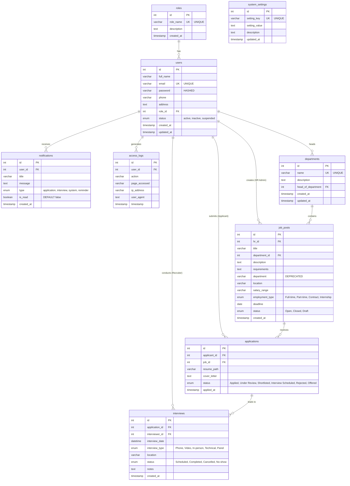

# HireFlow Database Schema Documentation

## Overview
Complete database schema documentation for HireFlow recruitment management system. This document provides detailed information about all database tables, their fields, relationships, and constraints.

## Database Information
- **Database Name**: `hireflow_db`
- **Engine**: MySQL/MariaDB
- **Character Set**: utf8mb4
- **Collation**: utf8mb4_unicode_ci
- **Total Tables**: 9

## Entity Relationship Diagram (EER)



## Table Details

### 1. `roles` Table
**Purpose**: Defines user roles and permissions in the system

| Field | Type | Null | Key | Default | Extra | Description |
|-------|------|------|-----|---------|--------|-------------|
| id | int(11) | NO | PRI | NULL | auto_increment | Primary key |
| role_name | varchar(50) | NO | UNI | NULL | | Unique role name |
| description | text | YES | | NULL | | Role description |
| created_at | timestamp | NO | | current_timestamp() | | Creation timestamp |

**Sample Data**:
- ID 1: System Administrator
- ID 2: HR Administrator  
- ID 3: Recruitment Manager
- ID 4: Applicant

### 2. `users` Table
**Purpose**: Stores all system users across different roles

| Field | Type | Null | Key | Default | Extra | Description |
|-------|------|------|-----|---------|--------|-------------|
| id | int(11) | NO | PRI | NULL | auto_increment | Primary key |
| full_name | varchar(255) | NO | | NULL | | User's full name |
| email | varchar(255) | NO | UNI | NULL | | Unique email address |
| password | varchar(255) | NO | | NULL | | Hashed password |
| phone | varchar(20) | YES | | NULL | | Phone number |
| address | text | YES | | NULL | | Physical address |
| role_id | int(11) | NO | MUL | NULL | | Foreign key to roles table |
| status | enum('active','inactive','suspended') | YES | | active | | Account status |
| created_at | timestamp | NO | | current_timestamp() | | Creation timestamp |
| updated_at | timestamp | NO | | current_timestamp() | on update current_timestamp() | Last update timestamp |

**Indexes**:
- PRIMARY KEY (id)
- UNIQUE KEY email (email)
- KEY role_id (role_id)

**Foreign Keys**:
- role_id REFERENCES roles(id)

### 3. `departments` Table
**Purpose**: Organizational departments for job categorization

| Field | Type | Null | Key | Default | Extra | Description |
|-------|------|------|-----|---------|--------|-------------|
| id | int(11) | NO | PRI | NULL | auto_increment | Primary key |
| name | varchar(100) | NO | UNI | NULL | | Unique department name |
| description | text | YES | | NULL | | Department description |
| head_of_department | int(11) | YES | MUL | NULL | | Foreign key to users table |
| created_at | timestamp | NO | | current_timestamp() | | Creation timestamp |
| updated_at | timestamp | NO | | current_timestamp() | on update current_timestamp() | Last update timestamp |

**Indexes**:
- PRIMARY KEY (id)
- UNIQUE KEY name (name)
- KEY head_of_department (head_of_department)

**Foreign Keys**:
- head_of_department REFERENCES users(id)

### 4. `job_posts` Table
**Purpose**: Job postings created by HR administrators

| Field | Type | Null | Key | Default | Extra | Description |
|-------|------|------|-----|---------|--------|-------------|
| id | int(11) | NO | PRI | NULL | auto_increment | Primary key |
| hr_id | int(11) | NO | MUL | NULL | | Foreign key to users table (HR who created) |
| title | varchar(200) | NO | | NULL | | Job title |
| department_id | int(11) | YES | MUL | NULL | | Foreign key to departments table |
| description | text | NO | | NULL | | Job description |
| requirements | text | YES | | NULL | | Job requirements |
| department | varchar(100) | YES | | NULL | | **DEPRECATED** - use department_id |
| location | varchar(100) | YES | | NULL | | Job location |
| salary_range | varchar(100) | YES | | NULL | | Salary range |
| employment_type | enum('Full-time','Part-time','Contract','Internship') | YES | | Full-time | | Employment type |
| deadline | date | YES | | NULL | | Application deadline |
| status | enum('Open','Closed','Draft') | YES | | Draft | | Job post status |
| created_at | timestamp | NO | | current_timestamp() | | Creation timestamp |

**Indexes**:
- PRIMARY KEY (id)
- KEY hr_id (hr_id)
- KEY department_id (department_id)

**Foreign Keys**:
- hr_id REFERENCES users(id)
- department_id REFERENCES departments(id)

### 5. `applications` Table
**Purpose**: Job applications submitted by applicants

| Field | Type | Null | Key | Default | Extra | Description |
|-------|------|------|-----|---------|--------|-------------|
| id | int(11) | NO | PRI | NULL | auto_increment | Primary key |
| applicant_id | int(11) | NO | MUL | NULL | | Foreign key to users table |
| job_id | int(11) | NO | MUL | NULL | | Foreign key to job_posts table |
| resume_path | varchar(255) | NO | | NULL | | Path to uploaded resume |
| cover_letter | text | YES | | NULL | | Cover letter text |
| status | enum('Applied','Under Review','Shortlisted','Interview Scheduled','Rejected','Offered') | YES | | Applied | | Application status |
| applied_at | timestamp | NO | | current_timestamp() | | Application timestamp |

**Indexes**:
- PRIMARY KEY (id)
- KEY applicant_id (applicant_id)
- KEY job_id (job_id)

**Foreign Keys**:
- applicant_id REFERENCES users(id)
- job_id REFERENCES job_posts(id)

### 6. `interviews` Table
**Purpose**: Interview scheduling and management

| Field | Type | Null | Key | Default | Extra | Description |
|-------|------|------|-----|---------|--------|-------------|
| id | int(11) | NO | PRI | NULL | auto_increment | Primary key |
| application_id | int(11) | NO | MUL | NULL | | Foreign key to applications table |
| interviewer_id | int(11) | NO | MUL | NULL | | Foreign key to users table |
| interview_date | datetime | NO | | NULL | | Scheduled interview date/time |
| interview_type | enum('Phone','Video','In-person','Technical','Panel') | YES | | In-person | | Type of interview |
| location | varchar(255) | YES | | NULL | | Interview location |
| status | enum('Scheduled','Completed','Cancelled','No-show') | YES | | Scheduled | | Interview status |
| notes | text | YES | | NULL | | Interview notes |
| created_at | timestamp | NO | | current_timestamp() | | Creation timestamp |

**Indexes**:
- PRIMARY KEY (id)
- KEY application_id (application_id)
- KEY interviewer_id (interviewer_id)

**Foreign Keys**:
- application_id REFERENCES applications(id)
- interviewer_id REFERENCES users(id)

### 7. `notifications` Table
**Purpose**: System notifications for users

| Field | Type | Null | Key | Default | Extra | Description |
|-------|------|------|-----|---------|--------|-------------|
| id | int(11) | NO | PRI | NULL | auto_increment | Primary key |
| user_id | int(11) | NO | MUL | NULL | | Foreign key to users table |
| title | varchar(255) | NO | | NULL | | Notification title |
| message | text | NO | | NULL | | Notification message |
| type | enum('application','interview','system','reminder') | YES | | system | | Notification type |
| is_read | tinyint(1) | YES | | 0 | | Read status (0=unread, 1=read) |
| created_at | timestamp | NO | | current_timestamp() | | Creation timestamp |

**Indexes**:
- PRIMARY KEY (id)
- KEY user_id (user_id)

**Foreign Keys**:
- user_id REFERENCES users(id)

### 8. `access_logs` Table
**Purpose**: User activity logging for security and auditing

| Field | Type | Null | Key | Default | Extra | Description |
|-------|------|------|-----|---------|--------|-------------|
| id | int(11) | NO | PRI | NULL | auto_increment | Primary key |
| user_id | int(11) | YES | MUL | NULL | | Foreign key to users table |
| action | varchar(100) | NO | | NULL | | Action performed |
| page_accessed | varchar(255) | YES | | NULL | | Page/endpoint accessed |
| ip_address | varchar(45) | YES | | NULL | | User's IP address |
| user_agent | text | YES | | NULL | | User's browser agent string |
| timestamp | timestamp | NO | | current_timestamp() | | Action timestamp |

**Indexes**:
- PRIMARY KEY (id)
- KEY user_id (user_id)

**Foreign Keys**:
- user_id REFERENCES users(id)

### 9. `system_settings` Table
**Purpose**: Application configuration settings

| Field | Type | Null | Key | Default | Extra | Description |
|-------|------|------|-----|---------|--------|-------------|
| id | int(11) | NO | PRI | NULL | auto_increment | Primary key |
| setting_key | varchar(100) | NO | UNI | NULL | | Unique setting identifier |
| setting_value | text | YES | | NULL | | Setting value |
| description | text | YES | | NULL | | Setting description |
| updated_at | timestamp | NO | | current_timestamp() | on update current_timestamp() | Last update timestamp |

**Indexes**:
- PRIMARY KEY (id)
- UNIQUE KEY setting_key (setting_key)

## Database Constraints

### Foreign Key Relationships
```sql
-- User role assignments
ALTER TABLE users ADD CONSTRAINT fk_users_role FOREIGN KEY (role_id) REFERENCES roles(id);

-- Department heads
ALTER TABLE departments ADD CONSTRAINT fk_dept_head FOREIGN KEY (head_of_department) REFERENCES users(id);

-- Job post creators and departments
ALTER TABLE job_posts ADD CONSTRAINT fk_job_hr FOREIGN KEY (hr_id) REFERENCES users(id);
ALTER TABLE job_posts ADD CONSTRAINT fk_job_dept FOREIGN KEY (department_id) REFERENCES departments(id);

-- Application relationships
ALTER TABLE applications ADD CONSTRAINT fk_app_user FOREIGN KEY (applicant_id) REFERENCES users(id);
ALTER TABLE applications ADD CONSTRAINT fk_app_job FOREIGN KEY (job_id) REFERENCES job_posts(id);

-- Interview relationships
ALTER TABLE interviews ADD CONSTRAINT fk_int_app FOREIGN KEY (application_id) REFERENCES applications(id);
ALTER TABLE interviews ADD CONSTRAINT fk_int_interviewer FOREIGN KEY (interviewer_id) REFERENCES users(id);

-- Notification relationships
ALTER TABLE notifications ADD CONSTRAINT fk_notif_user FOREIGN KEY (user_id) REFERENCES users(id);

-- Access log relationships
ALTER TABLE access_logs ADD CONSTRAINT fk_log_user FOREIGN KEY (user_id) REFERENCES users(id);
```

### Unique Constraints
- `roles.role_name` - Ensures unique role names
- `users.email` - Ensures unique email addresses
- `departments.name` - Ensures unique department names
- `system_settings.setting_key` - Ensures unique setting keys

### Enum Constraints
- `users.status`: 'active', 'inactive', 'suspended'
- `job_posts.employment_type`: 'Full-time', 'Part-time', 'Contract', 'Internship'
- `job_posts.status`: 'Open', 'Closed', 'Draft'
- `applications.status`: 'Applied', 'Under Review', 'Shortlisted', 'Interview Scheduled', 'Rejected', 'Offered'
- `interviews.interview_type`: 'Phone', 'Video', 'In-person', 'Technical', 'Panel'
- `interviews.status`: 'Scheduled', 'Completed', 'Cancelled', 'No-show'
- `notifications.type`: 'application', 'interview', 'system', 'reminder'

## Sample Data Overview

### Default Users
The database includes these default test users:
- **admin@hireflow.com** (System Admin) - Password@1
- **hr@hireflow.com** (HR Admin) - Password@1
- **recruiter@hireflow.com** (Recruitment Manager) - Password@1
- **athsara@hireflow.com** (Applicant) - Password@1

### Departments
8 departments are pre-configured:
- Human Resources, Information Technology, Marketing, Finance
- Operations, Customer Support, Research & Development, Quality Assurance

### Sample Content
- **16 Job Posts** across various departments
- **4 Applications** with different statuses
- **6 Notifications** for testing notification system
- **System Settings** for application configuration

## Performance Considerations

### Indexing Strategy
- Primary keys on all tables for fast lookups
- Foreign key indexes for efficient joins
- Unique indexes on email, role_name, department_name
- Consider adding indexes on frequently queried columns

### Optimization Recommendations
- Use prepared statements for all queries
- Implement connection pooling
- Regular database maintenance (OPTIMIZE TABLE)
- Monitor slow query log
- Consider partitioning for large tables (access_logs)

## Security Features

### Password Security
- All passwords are hashed using PHP's password_hash()
- Minimum 8 character password requirement
- Special character requirements can be enforced

### Access Control
- Role-based access control (RBAC) implementation
- Foreign key constraints ensure data integrity
- Access logging for audit trails
- Session management with timeout

### Data Validation
- Enum constraints for status fields
- NOT NULL constraints on critical fields
- Email format validation at application level
- File upload path validation

---

**Last Updated**: September 7, 2025  
**Database Version**: 1.0  
**Compatible With**: MySQL 5.7+, MariaDB 10.3+
